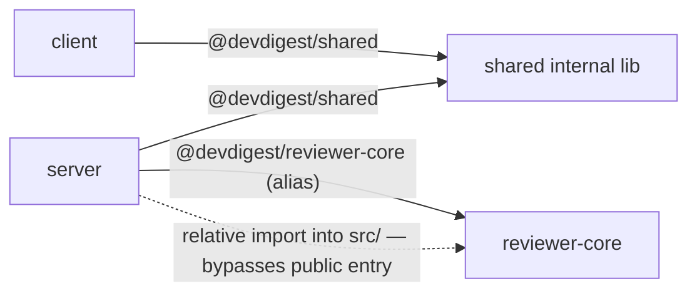

# Dependency Checker

DevDigest is **not** a monorepo — `server/`, `client/`, `reviewer-core/`, `e2e/`, and `mcp-server/`
each own a separate `package.json` and lockfile. There is no `workspace:*` protocol linking them.
Cross-package code sharing happens two ways, and telling them apart is the most important judgment
call this skill makes:

1. **TypeScript path aliases** (declared in each package's `tsconfig.json`, e.g. `@devdigest/shared`,
   `@devdigest/reviewer-core`, `@devdigest/ui`) — this is the *sanctioned* way to share code.
2. **Relative imports that reach across a package boundary** (e.g. `server/src/x.ts` importing
   `../../reviewer-core/src/pipeline.js` instead of going through `@devdigest/reviewer-core`) — this
   bypasses the other package's public entry point and is a boundary violation worth flagging, not a
   normal dependency.

Never describe these internal links as npm/workspace dependencies — they don't resolve through
`node_modules` and package managers don't track them. Keep them in their own part of the report.

## Gathering the data

If the data is already given to you inline in the conversation (this happens in evals, or when a
user pastes in `package.json` contents / `du -sh` output / grep results), use it directly — don't
ask for tool access or re-run commands you already have the answer to.

Otherwise, gather it yourself:

1. **Per-package manifests** — `Read` each package's `package.json` (start from the five above; use
   `Glob`/`ls` at the repo root first if you're unsure which packages currently exist — packages get
   added/removed over time). Note `dependencies` vs `devDependencies` separately; a dev-only tool
   bloating `node_modules` is a lower-severity issue than a runtime dependency doing the same.
2. **Installed sizes** — `du -sh <package>/node_modules/<dep>` for the dependencies you care about
   (usually the largest few per package, plus any you're about to flag). Don't shell out to `du -sh`
   on the whole `node_modules` tree by default — it's slow and the total isn't actionable on its own;
   per-dependency sizes are what let someone act.
3. **Internal boundary check** — `Grep` each package's `src/` for imports of another package's name
   or a relative path that climbs into a sibling package's `src/` (e.g. `grep -rn "reviewer-core/src"
   server/src`). Cross-reference against each package's public entry point (its `main`/`exports` in
   `package.json`, or its `src/index.ts`) to tell "goes through the front door" from "reaches into the
   basement."
4. **Version drift** — compare the same dependency's declared version string across every package's
   `package.json`. Same name, different pinned version = drift, even if both resolve to a compatible
   semver range on disk.
5. **Unused dependencies** — for a suspect dependency, `Grep` that package's `src/` for any import of
   it. Declared in `package.json` but zero matches under `src/` = unused (double-check it isn't a
   type-only import, a CLI invoked from `package.json` scripts, or a peer dependency of something else
   before calling it unused).

This skill only **reports and recommends** — it never edits a `package.json`, runs `npm uninstall`,
or otherwise changes a dependency itself. Every fix is something the user decides to do.

## Report structure

Always produce the report in exactly these five sections, in this order. A partial or reordered
report is a failure mode of this skill, not a stylistic choice — each section answers a distinct
question ("what did you look at" vs. "what does it cost" vs. "what should I do about it"), and
skipping one leaves a gap a developer will notice.

### 1. Scope

One line (or short list) naming exactly which packages were analyzed. If you couldn't inspect a
package (missing lockfile, `node_modules` not installed), say so here rather than silently omitting
it.

### 2. Dependency Graph

A Mermaid flowchart in a fenced ```mermaid block showing relationships **between packages/components**
(not every single npm leaf dependency — that's illegible). Use distinct edge or node styling to
separate the sanctioned path-alias links from any boundary-violating relative imports you found, so
the violation is visible in the picture, not just in prose. Example shape:



### 3. Size Breakdown

A markdown table, not a paragraph. One row per dependency worth mentioning (the largest ones, and
any you flag in Findings), with at minimum: package it belongs to, dependency name, installed size.
Round sizes as reported by `du`; don't fabricate precision you don't have.

| Package | Dependency | Installed size |
|---|---|---|
| client | next | 132M |
| e2e | playwright | 210M |

### 4. Findings & Priorities

Every finding sits under one of these tiers — never leave one unranked, and never invent a different
label:

- **P0** — actively wrong or risky: a boundary violation (relative import bypassing a package's
  public API), a dependency with a known critical vulnerability, or something that will break a build.
- **P1** — real cost or correctness risk, not urgent: version drift on a shared dependency (e.g. three
  different `zod` versions across packages), a genuinely unused dependency still declared.
- **P2** — worth doing, low urgency: a heavy dependency that has a lighter well-known alternative, a
  dev dependency that could be trimmed.
- **Info** — neutral observations that don't need action: notable size concentrations, expected
  duplication, context useful for the Summary.

Every finding names the specific package, dependency, and file — "consider optimizing dependencies"
is not a finding. "`server/package.json` declares `moment@2.30.1` but `grep -rn moment server/src`
finds zero imports — likely unused" is.

### 5. Summary

3–5 takeaways, ordered by priority (P0 first), each one concrete and actionable. Frame anything that
changes a dependency (removing, upgrading, deduplicating) as a recommendation for the user to confirm
and do themselves — phrase it as "consider removing X" / "worth aligning Y to one version," never as
something already done.

## Worked example

See how the pieces fit together: `server/package.json` declares `zod@3.23.8`, `client/package.json`
declares `zod@3.22.4`, `reviewer-core/package.json` declares `zod@3.23.8` — that's version drift
(P1, Findings), it shows up as one line in the Size Breakdown per package, and the Summary's top
recommendation might read "Align all three packages on a single pinned `zod` version — currently
`client` trails at `3.22.4` while `server` and `reviewer-core` are on `3.23.8`."
