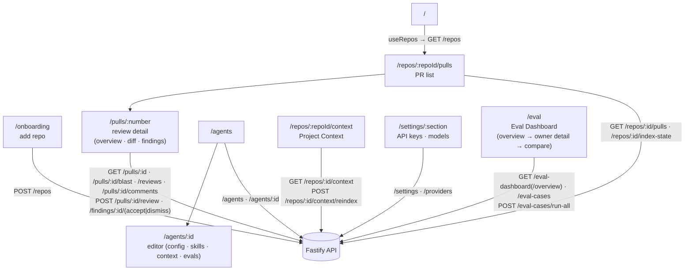

# `@devdigest/web` — the studio (Next.js 15)

The DevDigest UI: import repos, browse pull requests, inspect Blast Radius, run
and read AI reviews, and author agents. App Router + React Server/Client
components, with data loaded through **TanStack Query** hooks over the Fastify
API (`src/lib/hooks/blast.ts:7-15`).

- **Stack:** Next.js 15 (App Router), React 19, TanStack Query, `next-intl`
  (messages in `messages/<locale>/*.json`), `recharts`, `mermaid`,
  `react-markdown`, and `d3-force` for Blast Radius graph physics only (React
  owns the SVG DOM). UI primitives are vendored under `src/vendor/ui`
  (`@devdigest/ui`) and shared Zod contracts under `src/vendor/shared`
  (`@devdigest/shared`).
- **API base:** `NEXT_PUBLIC_API_BASE` (default `http://localhost:3001`), used by
  `src/lib/api.ts`. Every data hook lives in `src/lib/hooks/*`.
- **Run:** `pnpm dev` (`:3000`). **Test:** `pnpm test` (vitest + jsdom, fetch
  mocked — no API needed). **Typecheck:** `pnpm typecheck`.

## UI route map

Routes (`src/app/**/page.tsx`) and the API surface each leans on (via
`src/lib/hooks/*` → `src/lib/api.ts`):

Cross-cutting chrome lives in `src/components/app-shell` (nav, breadcrumbs,
`g`-then-key shortcuts). Pages are thin; feature logic sits in colocated
`_components/<Name>/` folders, each with its own `*.test.tsx`.

### Blast Radius on PR overview

The Overview tab renders Blast Radius between Intent and the PR description
(`src/app/repos/[repoId]/pulls/[number]/_components/OverviewTab/OverviewTab.tsx:20-38`).
The card exposes Tree and Graph views, keeps index-backed `empty`, `partial`,
and `degraded` states visible, and shows symbol, caller, endpoint, and cron data
from `GET /pulls/:id/blast`
(`src/app/repos/[repoId]/pulls/[number]/_components/BlastRadiusPanel/BlastRadiusPanel.tsx:60-164`).

Caller `file:line` links open the in-app diff when that exact new-side line is
rendered; otherwise they open the matching GitHub blob when repository and SHA
metadata are available
(`src/app/repos/[repoId]/pulls/[number]/_components/BlastRadiusPanel/helpers.ts:18-48`).
The Diff tab scrolls an in-app target into view
(`src/app/repos/[repoId]/pulls/[number]/_components/DiffTab/DiffTab.tsx:70-93`).

### PR Brief sections on PR overview

Three new sections render around the existing intent/blast panels, in this
fixed order: `BriefSummaryPanel` → `IntentPanel` (existing, untouched) →
`RiskAreasPanel` → `BlastRadiusPanel` (existing, untouched) →
`ReviewFocusPanel` → the PR description block
(`src/app/repos/[repoId]/pulls/[number]/_components/OverviewTab/OverviewTab.tsx:25-62`).
All three panels live in the sibling
`_components/BriefSections/` folder, backed by `GET`/`POST /pulls/:id/brief`
via `usePrBrief`/`useGenerateBrief`
(`src/lib/hooks/brief.ts:9-19,21-28`, exported from `src/lib/hooks/index.ts:14`)
— see [`server/README.md`](../server/README.md#brief--one-llm-call-pr-summary-shared-cache-key)
for the cache-key/state-flow design behind those two routes.

**`OverviewTab.tsx` calls `useBriefSections(prId)` exactly once**
(`OverviewTab.tsx:26`) and passes its returned `state` down to all three
panels as a prop — no panel calls the hook itself
(`BriefSummaryPanel.tsx:13`, `RiskAreasPanel.tsx:51`,
`ReviewFocusPanel.tsx:67`). This is a deliberate exception to this client's
usual "each panel self-fetches" pattern (`IntentPanel`/`BlastRadiusPanel`
each call their own hook): the three Brief panels provably need the *same*
in-flight mutation state — all of them must show the loading state during a
regenerate, and all of them must show the same error after a failed one —
and TanStack Query's `useMutation` does not synchronize pending/error state
across separate `useMutation()` instances without an explicit `mutationKey`.
With a single call site there is exactly one `useMutation()` (and one
`useQuery()`) for the whole feature, so `mutation.isPending`/
`mutation.isError` are trivially the single source of truth for every
consumer, with no `mutationKey`/`useIsMutating` wiring needed
(`_components/BriefSections/useBriefSections.ts:16-40`).

`useBriefSections` composes `useAgents()` + `pickDefaultAgent` — there is no
agent-selector UI; the default is the first `enabled` agent sorted by `name`
then `id`, since `Agent` has no `default`/`created_at` field
(`_components/BriefSections/helpers.ts:10-16`) — with `usePrBrief` and
`useGenerateBrief` into one
`status: "no-agent" | "loading" | "empty" | "error" | "ready"` state
(`_components/BriefSections/types.ts:7-14`). Each panel renders purely off
that `status`: `loading` shows a `Skeleton` in place of any previous Brief's
content, with the Summary panel's regenerate control disabled
(`BriefSummaryPanel.tsx:18-40`); `error` shows the failure message and a
retry action on the Summary panel only, while Risk Areas and Review Focus
render nothing (`BriefSummaryPanel.tsx:42-49`, `RiskAreasPanel.tsx:54-56`,
`ReviewFocusPanel.tsx:70-72`); `empty` shows an explicit "Generate brief" CTA
on the Summary panel — there is no auto-generation.

Review Focus items reuse the existing `?tab=diff&file=&line=` deep link
(`resolveReviewFocusDestination`,
`_components/BriefSections/helpers.ts:25-36`, built on `DiffTab`'s
`buildDiffLineRoute`) when the cited file is part of this PR's diff, and
show a non-navigating "not in this PR's diff" message otherwise
(`ReviewFocusPanel.tsx:26-32`).

### Eval Dashboard (`/eval`)

`app/eval/page.tsx` is a thin state holder, not a placeholder: it renders
`EvalOverview` until a row is selected, then swaps to `EvalOwnerDetail` for
that owner, clearing back to the overview on "back"
(`app/eval/page.tsx:19-37`). Reachable from the existing SKILLS LAB →
"Eval Dashboard" nav entry (`src/vendor/ui/nav.ts:35`, untouched).

- **`EvalOverview`** (`_components/EvalOverview/EvalOverview.tsx:36-122`) —
  one row per agent/skill owner via `useEvalOverview()`
  (`GET /eval-dashboard/overview`), each with its latest run timestamp, pass
  count, and Recall/Precision/Citation; "Run all agents" shows a confirmation
  naming the total runnable case count before firing a workspace-wide bulk
  run.
- **`EvalOwnerDetail`** (`_components/EvalOwnerDetail/EvalOwnerDetail.tsx:37-111`)
  — one owner's regression alert banner (when present), a metric card per
  metric with its delta, the trend chart, and a recent-runs table; selecting
  exactly two runs enables "Compare".
- **`CompareRunsModal`** (`_components/CompareRunsModal/CompareRunsModal.tsx:50-130`)
  — per-metric old→new deltas (Recall/Precision/Citation/Cost) plus a
  system-prompt diff read from the two selected runs' matched
  `agent_versions` snapshots (existing `GET /agents/:id/versions`, no new
  endpoint). "Promote" confirms, then calls `PUT /agents/:id` with the newer
  snapshot's config followed by `POST /agents/:id/skills` with its
  linked-skill set (`CompareRunsModal.tsx:63-81`) — two calls, since
  `PUT /agents/:id` doesn't accept a `skills` field.

Data hooks for all of the above live in `src/lib/hooks/eval.ts`
(`useEvalCases`, `useEvalCase`, `useRunEvalCase`, `useRunAllEvals` +
`useBulkRunStatus` polling, `useEvalDashboard`, `useEvalOverview`,
`useEvalSeed`, …), mirroring the `useSmartDiff`/`useQuery` shape.

### Evals tab (Agent Editor + Skill Editor)

Both `AgentEditor` (`app/agents/[id]/_components/AgentEditor/AgentEditor.tsx:54-55`)
and `SkillEditor` (`app/skills/[id]/_components/SkillEditor/SkillEditor.tsx:59`)
add an `evals` tab that renders the shared
`components/eval-tab/EvalsTab/EvalsTab.tsx:43-157` — a metric strip, the
owner's case list in exactly one of passing / failing / never-run, per-case
run + edit controls, and "Run all evals", all disabled while a run is
already in flight for that owner. A skill's Evals tab runs its cases through
whichever currently-enabled agent has that skill linked; with none linked,
running is disabled and shows a "Link this skill to an agent" hint
(`SkillEditor.tsx:22-41`). Both editors open the shared
`components/eval-case-editor/EvalCaseEditor` for "New eval case" and each
case's edit control.

### "Turn into eval case" (FindingCard)

The expanded `FindingCard` action row
(`app/repos/[repoId]/pulls/[number]/_components/FindingCard/FindingCard.tsx:105-140`)
adds a third ghost button next to Accept and Dismiss. It calls
`useEvalSeed()` (`POST /findings/:id/eval-seed`) and, on success, opens
`EvalCaseEditor` pre-filled with the returned `EvalCaseInput`
(`FindingCard.tsx:54-58,144`) — an independent action, not a new member of
`FindingActionKind`.

## Testing

Component/interaction tests (`*.test.tsx`) run under vitest + jsdom with `fetch`
mocked, so they need neither the API nor a browser. The real browser journeys
(client + API + seeded DB) are covered by the deterministic agent-browser suite
in [`../e2e`](../e2e/README.md) and the `e2e-web.yml` workflow. See
[`../TESTING.md`](../TESTING.md).
