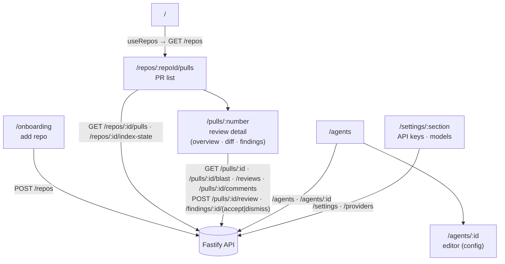

# `@devdigest/web` — the studio (Next.js 15)

The DevDigest UI: import repos, browse pull requests, inspect Blast Radius, run
and read AI reviews, and author agents. App Router + React Server/Client
components, with data loaded through **TanStack Query** hooks over the Fastify
API (`src/lib/hooks/blast.ts:7-15`).

- **Stack:** Next.js 15 (App Router), React 19, TanStack Query, `next-intl`
  (messages in `messages/<locale>/*.json`), `recharts`, `mermaid`,
  `react-markdown`, and `d3-force` for Blast Radius graph physics only (React
  owns the SVG DOM). UI primitives are vendored under `src/vendor/ui`
  (`@devdigest/ui`) and shared Zod contracts under `src/vendor/shared`
  (`@devdigest/shared`).
- **API base:** `NEXT_PUBLIC_API_BASE` (default `http://localhost:3001`), used by
  `src/lib/api.ts`. Every data hook lives in `src/lib/hooks/*`.
- **Run:** `pnpm dev` (`:3000`). **Test:** `pnpm test` (vitest + jsdom, fetch
  mocked — no API needed). **Typecheck:** `pnpm typecheck`.

## UI route map

Routes (`src/app/**/page.tsx`) and the API surface each leans on (via
`src/lib/hooks/*` → `src/lib/api.ts`):

Cross-cutting chrome lives in `src/components/app-shell` (nav, breadcrumbs,
`g`-then-key shortcuts). Pages are thin; feature logic sits in colocated
`_components/<Name>/` folders, each with its own `*.test.tsx`.

### Blast Radius on PR overview

The Overview tab renders Blast Radius between Intent and the PR description
(`src/app/repos/[repoId]/pulls/[number]/_components/OverviewTab/OverviewTab.tsx:20-38`).
The card exposes Tree and Graph views, keeps index-backed `empty`, `partial`,
and `degraded` states visible, and shows symbol, caller, endpoint, and cron data
from `GET /pulls/:id/blast`
(`src/app/repos/[repoId]/pulls/[number]/_components/BlastRadiusPanel/BlastRadiusPanel.tsx:60-164`).

Caller `file:line` links open the in-app diff when that exact new-side line is
rendered; otherwise they open the matching GitHub blob when repository and SHA
metadata are available
(`src/app/repos/[repoId]/pulls/[number]/_components/BlastRadiusPanel/helpers.ts:18-48`).
The Diff tab scrolls an in-app target into view
(`src/app/repos/[repoId]/pulls/[number]/_components/DiffTab/DiffTab.tsx:70-93`).

## Testing

Component/interaction tests (`*.test.tsx`) run under vitest + jsdom with `fetch`
mocked, so they need neither the API nor a browser. The real browser journeys
(client + API + seeded DB) are covered by the deterministic agent-browser suite
in [`../e2e`](../e2e/README.md) and the `e2e-web.yml` workflow. See
[`../TESTING.md`](../TESTING.md).
