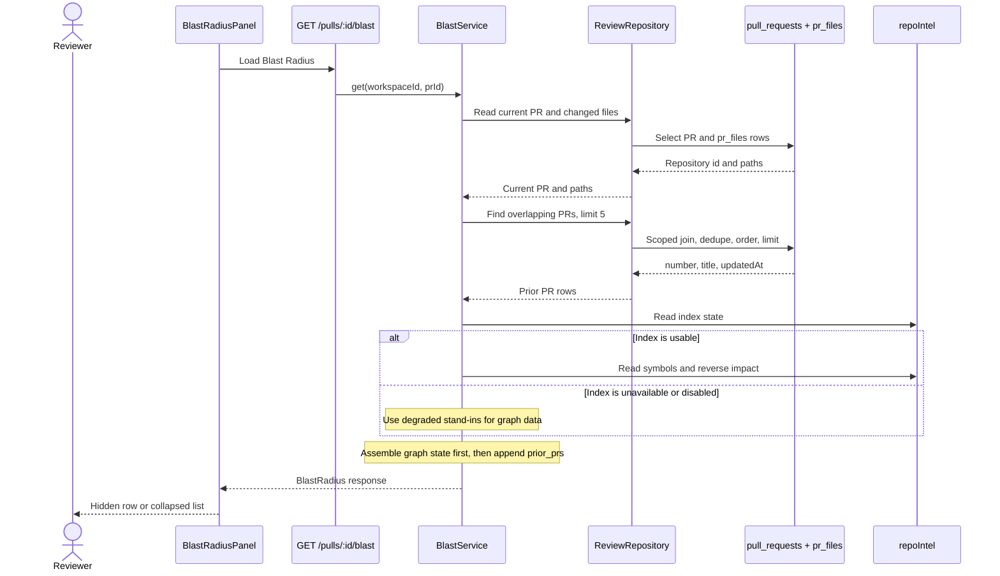

# Blast Radius: Prior PRs

Use **Prior PRs touching these files** to find other imported pull requests
that changed at least one file in the current PR. The list is reference data:
it does not change the Blast Radius graph, state, truncation, or index status.
(`server/src/modules/reviews/repository/pull.repo.ts:57-97`,
`server/src/modules/blast/assemble.ts:207-243`)

The package-level diagrams remain in the
[server README](../server/README.md#request--di-flow) and
[client README](../client/README.md#ui-route-map). This page covers only the
cross-package Prior PRs flow.

## What appears in the UI

The PR Overview tab renders the Blast Radius card between Intent and the PR
description. A populated Prior PRs row sits at the bottom of that card,
collapsed by default, with a count badge. Expanding it shows each PR number,
title, compact age, and a link to `/repos/:repoId/pulls/:number`.
(`client/src/app/repos/[repoId]/pulls/[number]/_components/OverviewTab/OverviewTab.tsx:20-38`,
`client/src/app/repos/[repoId]/pulls/[number]/_components/BlastRadiusPanel/BlastRadiusPanel.tsx:101-109`,
`client/src/app/repos/[repoId]/pulls/[number]/_components/BlastRadiusPanel/BlastRadiusPanel.tsx:131-163`,
`client/src/app/repos/[repoId]/pulls/[number]/_components/BlastRadiusPanel/_components/PriorPrsRow.tsx:17-55`)

The row stays hidden when `prior_prs` is absent, `null`, or empty. It remains
available when the Blast Radius result itself is `empty`, `partial`, or
`degraded`, because the list does not depend on repo-intel data.
(`client/src/app/repos/[repoId]/pulls/[number]/_components/BlastRadiusPanel/_components/PriorPrsRow.tsx:21-30`,
`client/src/app/repos/[repoId]/pulls/[number]/_components/BlastRadiusPanel/BlastRadiusPanel.tsx:101-109`,
`client/src/app/repos/[repoId]/pulls/[number]/_components/BlastRadiusPanel/BlastRadiusPanel.tsx:113-163`,
`server/src/modules/blast/service.ts:73-99`)

## Selection rules

| Rule | Behaviour |
|---|---|
| Scope | Match both `workspace_id` and `repo_id`. |
| Overlap | Match any current-PR file path against `pr_files.path`. |
| Current PR | Exclude it by PR id. |
| Duplicates | Group by PR id, so overlap on several files produces one row. |
| Order | `updated_at` descending, null timestamps last, then PR number descending. |
| Limit | Return at most `MAX_PRIOR_PRS`, currently 5. |
| No changed files | Return `[]` without issuing the overlap query. |

These rules live in the review repository and the Blast Radius product limit.
(`server/src/modules/reviews/repository/pull.repo.ts:50-97`,
`server/src/modules/blast/constants.ts:1-5`,
`server/src/modules/blast/service.ts:70-82`)

The query does not filter on merge state or require an `updated_at` earlier
than the current PR. In this label, “Prior PRs” means other imported PRs with a
matching file path, ordered by `updated_at`.
(`server/src/modules/reviews/repository/pull.repo.ts:79-97`,
`server/src/db/schema/pulls.ts:15-28`)

## Request and data flow



The Fastify route resolves workspace context and delegates to `BlastService`.
The service reads PR data through `ReviewRepository`; Drizzle stays inside
`repository/pull.repo.ts`. The prior-PR read finishes before the repo-index
branch, while the pure assembler maps database dates to ISO strings only after
it derives the Blast Radius state. No LLM provider appears on this request
path. (`server/src/modules/blast/routes.ts:20-31`,
`server/src/modules/blast/service.ts:58-99`,
`server/src/modules/reviews/repository.ts:35-64`,
`server/src/modules/reviews/repository/pull.repo.ts:66-97`,
`server/src/modules/blast/assemble.ts:135-170`,
`server/src/modules/blast/assemble.ts:207-243`)

## Contract and compatibility

`GET /pulls/:id/blast` returns `prior_prs` alongside `changed_symbols` and
`downstream`. Each item contains an integer `number`, a `title`, and an
`updated_at` value. The current server emits an ISO string or `null`; the
shared contract accepts a string, `null`, or absence. It likewise accepts a
missing or null list for compatibility, while the current server assembler
always emits an array. (`server/src/vendor/shared/contracts/brief.ts:103-137`,
`server/src/modules/blast/assemble.ts:150-170`,
`server/src/modules/blast/assemble.ts:227-243`)

The server and client keep byte-identical copies of this contract in
`server/src/vendor/shared/contracts/brief.ts` and
`client/src/vendor/shared/contracts/brief.ts`. Keep both copies coordinated
when changing `PriorPr` or `BlastRadius`.
(`server/src/vendor/shared/contracts/brief.ts:103-137`,
`client/src/vendor/shared/contracts/brief.ts:103-137`,
`server/AGENTS.md:7-13`, `client/AGENTS.md:7-13`)

The client formats `updated_at` as `now`, minutes, hours, days, 30-day months,
or 365-day years. Missing or invalid timestamps render as an em dash; future
timestamps clamp to `now`. (`client/src/app/repos/[repoId]/pulls/[number]/_components/BlastRadiusPanel/helpers.ts:102-129`)

## Verify the feature

Run the pure assembler test and the Docker-backed repository and route tests:

```sh
cd server
pnpm exec vitest run test/blast-assemble.test.ts
pnpm exec vitest run test/blast-prior-prs.it.test.ts test/blast.it.test.ts
pnpm typecheck
```

Run the focused client interaction and formatter tests:

```sh
cd client
pnpm exec vitest run 'src/app/repos/[repoId]/pulls/[number]/_components/BlastRadiusPanel/BlastRadiusPanel.test.tsx' 'src/app/repos/[repoId]/pulls/[number]/_components/BlastRadiusPanel/helpers.test.ts'
pnpm typecheck
```

The repository tests cover deduplication, current/repo/workspace isolation,
ordering, the cap, null timestamps, and empty paths. The route and assembler
tests pin index independence and zero LLM calls. The client tests cover the
collapsed interaction, every PR link, hidden empty data, the Blast Radius empty
state, and all age buckets. (`server/test/blast-prior-prs.it.test.ts:205-229`,
`server/test/blast-prior-prs.it.test.ts:366-389`,
`server/test/blast.it.test.ts:273-294`,
`server/test/blast.it.test.ts:496-520`,
`server/test/blast-assemble.test.ts:300-379`,
`client/src/app/repos/[repoId]/pulls/[number]/_components/BlastRadiusPanel/BlastRadiusPanel.test.tsx:295-359`,
`client/src/app/repos/[repoId]/pulls/[number]/_components/BlastRadiusPanel/helpers.test.ts:111-154`)
