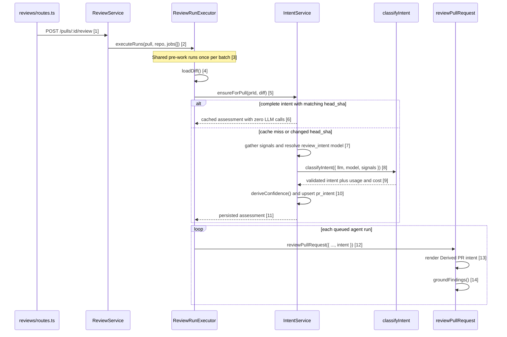

# Intent Layer

The Intent Layer derives a PR summary, in-scope list, out-of-scope list, and
code-derived confidence tier, persists the current assessment, shows it on the
PR Overview tab, and passes it to the main reviewer prompt.
(`server/src/modules/intent/service.ts:140-219`,
`client/src/app/repos/[repoId]/pulls/[number]/_components/IntentPanel/IntentPanel.tsx:70-116`,
`reviewer-core/src/prompt.ts:52-70`)

## Flow

Diagram refs: [1] `server/src/modules/reviews/routes.ts:27-43`; [2]
`server/src/modules/reviews/service.ts:103-137`; [3]
`server/src/modules/reviews/run-executor.ts:81-89`; [4]
`server/src/modules/reviews/run-executor.ts:115-125`; [5]
`server/src/modules/reviews/run-executor.ts:127-143`; [6]
`server/src/modules/intent/service.ts:106-110`; [7]
`server/src/modules/intent/service.ts:151-160`; [8]
`server/src/modules/intent/service.ts:162-167`; [9]
`reviewer-core/src/intent/classify.ts:45-64`; [10]
`server/src/modules/intent/service.ts:169-191`; [11]
`server/src/modules/intent/service.ts:208-219`; [12]
`server/src/modules/reviews/run-executor.ts:260-290`; [13]
`reviewer-core/src/prompt.ts:141-165`; [14]
`reviewer-core/src/review/run.ts:197-215`.

The classifier receives fetched signals in this priority order: linked plan,
linked issue, PR description, PR title, commit messages, changed paths, and
diff; external URLs are recorded but have a zero prompt budget.
(`reviewer-core/src/intent/prompt.ts:25-52`,
`reviewer-core/src/intent/prompt.ts:73-103`)

The Overview panel renders the derived summary, both scope lists, the confidence
badge and reason, source fetch status, a first-run Derive intent action, and a
Recompute action.
(`client/src/app/repos/[repoId]/pulls/[number]/_components/IntentPanel/IntentPanel.tsx:35-116`,
`client/src/app/repos/[repoId]/pulls/[number]/_components/IntentPanel/_components/ConfidenceBadge/ConfidenceBadge.tsx:24-30`)

Opening or reloading the PR detail page already refreshes `body`, `commits`,
and `files` from GitHub on every visit — no button needed.
(`server/src/modules/pulls/routes.ts:47-93`, `client/src/lib/hooks/core.ts:136-142`)
**Sync from GitHub** exists for the fields that read does *not* touch:
`title`, `head_sha`, and `status`. The header's button calls the manual
`POST /repos/:id/poll` mutation, then invalidates PR-list and PR-detail
queries.
(`client/src/app/repos/[repoId]/pulls/[number]/_components/PrDetailHeader/PrDetailHeader.tsx:40-56`,
`client/src/app/repos/[repoId]/pulls/[number]/_components/PrDetailHeader/PrDetailHeader.tsx:111-119`,
`server/src/modules/polling/routes.ts:9-20,49-57`)
The PR-list page also re-syncs `head_sha` on its own every 60s and on window
focus, but only while that page is mounted — sitting on the PR detail page
does not benefit from it.
(`client/src/lib/hooks/core.ts:124-134`)

The two actions matter for two different GitHub edits:

- **A new commit** changes `head_sha` on GitHub, but the detail-page read
  above never touches `head_sha` — so, while sitting on the PR detail page,
  press **Sync from GitHub** to pick it up. Once the local `head_sha` changes,
  the normal review path detects the mismatch and reclassifies intent on the
  next run automatically; **Recompute** is not needed for this case.
  (`server/src/modules/intent/service.ts:106-110`)
- **A description-only edit** never changes `head_sha`, so the normal review
  path keeps reusing the cached assessment even though the detail page already
  shows the new body. Press **Recompute**: it calls `classify()` with
  `force: true`, which reclassifies regardless of `head_sha`.
  (`server/src/modules/intent/service.ts:73-83`,
  `client/src/app/repos/[repoId]/pulls/[number]/_components/IntentPanel/IntentPanel.tsx:89-98`,
  `client/src/lib/hooks/intent.ts:18-23`)

## API

- `GET /pulls/:id/intent` returns the persisted complete assessment and returns
  `404` when no complete assessment exists. (`server/src/modules/intent/routes.ts:22-25`,
  `server/src/modules/intent/service.ts:60-70`)
- `POST /pulls/:id/intent` force-recomputes the assessment and is limited to five
  requests per minute. (`server/src/modules/intent/routes.ts:27-36`,
  `server/src/modules/intent/service.ts:73-76`)

## Quality notes for the pull request

- Confidence is deterministic: fetched non-empty plan/issue content is high, a
  description with at least 200 non-whitespace characters after markdown-noise
  removal is medium, and remaining signal sets are low.
  (`reviewer-core/src/intent/confidence.ts:34-47`,
  `reviewer-core/src/intent/confidence.ts:57-120`)
- In-repo plan reads reject unsafe paths and realpath/symlink escapes; arbitrary
  external URLs are recorded as unfetched.
  (`server/src/modules/intent/signals.ts:41-59`,
  `server/src/modules/intent/signals.ts:101-139`,
  `server/src/modules/intent/signals.ts:166-176`)
- Classifier input and the derived reviewer slot are delimiter-wrapped untrusted
  data, and the shared guard says intent cannot suppress real security or
  correctness defects.
  (`reviewer-core/src/intent/prompt.ts:83-103`,
  `reviewer-core/src/prompt.ts:16-34`, `reviewer-core/src/prompt.ts:52-70`)
- Intent derivation runs after diff loading and before the per-agent loop; a
  derivation error logs an informational skip and the reviews continue without
  an intent slot.
  (`server/src/modules/reviews/run-executor.ts:115-159`,
  `server/src/modules/reviews/run-executor.ts:280-283`)
- The shared derivation step fans out through `RunLogger`, and completed reviews
  persist the rendered prompt assembly and the full buffered pre-work log in
  each run trace.
  (`server/src/platform/run-logger.ts:4-17`,
  `server/src/modules/reviews/run-executor.ts:338-370`)
- A successful classification writes a structured pino record with provider,
  model, duration, token counts, cost, confidence, and fetched source names.
  (`server/src/modules/intent/service.ts:193-206`)
- Classification usage and cost are stored with `pr_intent`, while each
  `agent_runs` record receives usage and cost from the main-review outcome.
  (`server/src/modules/intent/service.ts:176-191`,
  `server/src/modules/reviews/run-executor.ts:291-355`)
- `pr_intent` keeps one row per PR with source metadata, classifier/model,
  `head_sha`, token counts, cost, duration, and generation time.
  (`server/src/db/schema/reviews.ts:49-74`)
- `POST /repos/:id/poll` itself updates list metadata (`title`, `head_sha`,
  `status`, and `updated_at`); body/files/commits are refreshed by the subsequent
  PR-detail read described in Flow.
  (`server/src/modules/polling/routes.ts:28-57`,
  `server/src/modules/pulls/routes.ts:47-95`)

## Demo checklist

- In **Settings → Feature Models**, choose the `PR Review · Intent` model.
  (`client/src/lib/feature-models.ts:21-27`,
  `client/src/app/settings/[section]/_components/SettingsView/_components/SettingsModels/SettingsModels.tsx:30-64`)
- Open a PR Overview and derive intent if the endpoint returns `404`.
  (`client/src/app/repos/[repoId]/pulls/[number]/_components/OverviewTab/OverviewTab.tsx:13-22`,
  `client/src/app/repos/[repoId]/pulls/[number]/_components/IntentPanel/IntentPanel.tsx:44-57`)
- Show the summary, both scope lists, confidence tooltip, and source statuses.
  (`client/src/app/repos/[repoId]/pulls/[number]/_components/IntentPanel/IntentPanel.tsx:70-116`,
  `client/src/app/repos/[repoId]/pulls/[number]/_components/IntentPanel/_components/ConfidenceBadge/ConfidenceBadge.tsx:24-30`)
- Edit the PR description on GitHub, reload the PR detail page (the new body
  arrives on its own — no button needed), then press **Recompute** to bypass
  the unchanged-`head_sha` cache.
  (`server/src/modules/pulls/routes.ts:47-93`,
  `client/src/app/repos/[repoId]/pulls/[number]/_components/IntentPanel/IntentPanel.tsx:89-98`,
  `server/src/modules/intent/service.ts:73-83`)
- Run a review and show `Deriving PR intent` in the run log and the non-null
  `prompt_assembly.intent` stored with the trace.
  (`server/src/modules/reviews/run-executor.ts:127-154`,
  `reviewer-core/src/prompt.ts:174-183`,
  `server/src/modules/reviews/run-executor.ts:338-370`)
