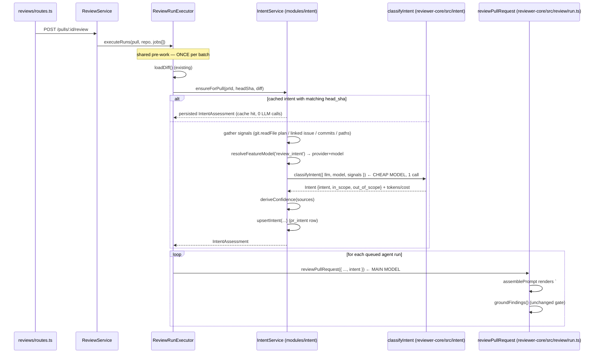

# Development Plan: Intent Layer

## Context

DevDigest's reviewer today sees the diff, the PR title/body, and (when indexed)
a repo map — but it has no explicit statement of *what this PR is supposed to
do*, so it cannot reason about scope creep. This plan adds an **Intent Layer**:
a cheap, separate LLM pass that derives a PR's motivation and its in-scope /
out-of-scope lists from the strongest available signals, records how confident
that derivation is, surfaces it as an INTENT panel on the PR overview, and
threads it into the main review prompt so the primary reviewer model can judge
out-of-scope changes. Much of the scaffolding already exists in the starter and
sits empty (`pr_intent` table, the `Intent` contract, a `review_intent` entry in
the feature-model registry, and a Settings model picker) — this plan fills it in
rather than inventing parallel machinery.

## Requirements

- **REQ-1** — Intent classification runs on a **separate LLM from the main
  review model**, resolved through the existing per-feature model registry
  (`review_intent` in `FEATURE_MODELS`) so it is **user-configurable in Settings**,
  never hardcoded. Reference pattern: PR-Agent/Qodo Merge's `model` +
  `model_weak` split, adapted to DevDigest's existing `resolveFeatureModel`
  mechanism (`server/src/modules/settings/feature-models.ts:51`).
- **REQ-2** — When the PR carries no explicit intent documentation, an intent is
  still produced from indirect signals (PR title, commit messages, changed file
  paths, diff) and is marked with a **visibly lower confidence tier**, surfaced
  in the UI — not only computed internally. Commit messages are included because
  they measurably improve diff-only intent inference (CommitSuite, arXiv
  2605.02256).
- **REQ-3** — When the description links a plan/spec, that content is **read and
  given priority** over indirect inference. v1 resolves **in-repo markdown
  plan/spec paths** (from the repo clone) and the **already-resolved GitHub
  linked issue**; arbitrary external doc URLs are recorded as an *unfetched*
  source with a reason and are explicitly out of scope for v1 (see
  [Out of Scope](#out-of-scope)).
- **REQ-4** — Confidence is a **discrete tier (high / medium / low) derived
  deterministically in code from which signals were available**, never a
  model-self-reported number. Rationale: LLM self-reported confidence skews high
  (8–10/10) and does not predict correctness (arXiv 2603.27524); no vendor
  publishes a scoring formula, so a signal-availability tier is the defensible
  choice.
- **REQ-5** — The derived intent (summary + in-scope + out-of-scope + confidence
  + sources used) is passed into the **main review prompt context** as a
  delimiter-wrapped untrusted slot, and appears in the persisted `RunTrace`
  prompt assembly.
- **REQ-6** — Intent classification is **best-effort**: any failure (no key,
  provider error, unreadable plan file) degrades silently to the pre-Intent
  prompt, byte-identical, and the review still runs.
- **REQ-7** — The intent slot **never descopes the review**. The grounding gate
  (`reviewer-core/src/grounding.ts`) is untouched, and the prompt states
  explicitly that an "out of scope" label never suppresses a real defect.
- **REQ-8** — Per-classification observability (model, provider, latency,
  tokens, cost, confidence tier, which sources were fetched, cache hit) is
  logged through the **existing** `RunLogger` + pino path and persisted on the
  `pr_intent` row.

## Affected Modules & Contracts

- **server** (`@devdigest/api`) — new `modules/intent/` (routes + service +
  signals), widened `pr_intent` persistence, run-executor wiring, DB schema +
  one generated migration.
- **client** (`@devdigest/web`) — new `IntentPanel` on the PR overview tab, new
  React Query hooks, new i18n namespace; **no new Settings component** (the
  picker already exists).
- **reviewer-core** (`@devdigest/reviewer-core`) — new pure `src/intent/`
  (schema, prompt, classifier, confidence tiers) + a new `intent` prompt slot.
- **e2e** — follow-up only (T16); not assigned to `implementer`.

### Contract changes in `@devdigest/shared`

`server/src/vendor/shared/` and `client/src/vendor/shared/` are **do-not-touch
without coordination** (root `CLAUDE.md`) and are **not auto-synced**. Task T1
*is* that coordination and must edit both mirrors and diff them.

| Contract | Change | Blast radius |
|---|---|---|
| `Intent` (`contracts/brief.ts:9`) | **Unchanged.** Stays `{ intent, in_scope, out_of_scope }` — it doubles as the LLM structured-output schema, and per REQ-4 the model must not self-report confidence. | none |
| `IntentConfidence`, `IntentSignal`, `IntentSource`, `IntentAssessment` | **New**, additive, in `contracts/brief.ts`. `IntentAssessment = Intent.extend({ confidence, confidence_reason, sources, provider, model, generated_at })`. | none |
| `PrBrief` (`contracts/brief.ts:116`) | **Unchanged** — still composes the plain `Intent`. | none |
| `PrIntentRecord` (`contracts/review-api.ts:60`) | **Redefined** to `IntentAssessment.extend({ pr_id })`. Verified zero consumers today (`grep -rn "PrIntentRecord" server/src client/src` returns only the definition + its client mirror) — T1 must re-run that grep and stop if that is no longer true. | nil today; re-verify |
| `PromptAssembly` (`contracts/trace.ts:39`) | **New nullish field** `intent`, following the existing `repo_map` / `pr_description` precedent (`contracts/trace.ts:46-50`). All existing writers keep typechecking. | additive |

## Architecture Notes

### Onion layers touched

| Ring | What lands there |
|---|---|
| **Domain** | `reviewer-core/src/intent/*` — pure: schema, prompt assembly, `classifyIntent` (one injected `LLMProvider`, nothing else), `deriveConfidence` (pure function of the source list). Mirrors `review/run.ts`'s shape. `@devdigest/shared` contracts. |
| **Application** | `server/src/modules/intent/service.ts` (coordinates git clone reads + GitHub issue + settings + LLM + persistence), `signals.ts` (pure helpers), and the intent call site in `modules/reviews/run-executor.ts`. |
| **Infrastructure** | `modules/reviews/repository/pull.repo.ts` (the sole owner of `pr_intent` writes — reused, **not** duplicated in a second repository), `container.reviewRepo` (already exposed at `platform/container.ts`). |
| **Presentation** | `server/src/modules/intent/routes.ts` (Zod params, thin) + one line in `modules/index.ts`. |

Anything the domain needs from outside (clone file reads, the GitHub issue, the
workspace's model choice) is resolved in `service.ts` and passed to
`classifyIntent` as **already-resolved strings** — the same contract
`reviewPullRequest` uses for `skills` / `specs` (`reviewer-core/src/review/run.ts:26`).
`reviewer-core` must not gain a DB, GitHub, or fs import.

Per the graduated-layering rule, `intent` is a **full-split** module (it makes a
decision, derives a value, and coordinates several data sources). Update
`.claude/skills/onion-architecture/LAYER_MAP.md`'s module table as part of T7.

### Do-not-touch items in play

- `server/src/db/migrations/` — **never hand-edited**. T2 edits
  `src/db/schema/reviews.ts` and runs `pnpm db:generate`; the emitted
  `0012_*.sql` + `meta/0012_snapshot.json` + `_journal.json` are reviewed, not
  authored. (Latest applied is `0011_furry_lightspeed`.)
- `server/src/vendor/shared/` + `client/src/vendor/shared/` — see the contract
  table above; T1 owns both mirrors together.
- `reviewer-core/src/grounding.ts` — the citation gate. **Not touched by any
  task.** Intent influences the prompt only; findings are still dropped by the
  same mechanical gate, and the score is still recomputed from survivors
  (`reviewer-core/src/review/run.ts:196-208`).

### Prior art this plan reuses (read these before implementing)

- `server/src/modules/conventions/extractor.ts` — the closest precedent for a
  cheap feature-model LLM call: `resolveFeatureModel(...)` →
  `container.llm(provider)` → `completeStructured({ schema, temperature: 0,
  maxRetries: 1 })`, with all repo text wrapped by `wrapUntrusted(...)`
  (`extractor.ts:172-206`). Also the **path-safety** pattern —
  `safeRepoPath()` + `realpath` containment (`extractor.ts:23-57`) — which T7
  must apply before any in-repo plan file is read.
- `server/src/platform/run-logger.ts:7,16` — already names "derive intent" as
  the canonical fan-out pre-work step. Use `runLog.step(...)`, do not invent a
  new logger.
- `server/src/modules/reviews/run-executor.ts:52,61-63,148` — comments already
  reserve the "loads the diff + intent once, then map-reduces each agent" slot.
- `reviewer-core/src/prompt.ts:16-28` — `INJECTION_GUARD` **already** names
  "derived intent/scope" as untrusted data. It is currently module-private;
  T5 exports it so the intent prompt can reuse the one shared guard.
- `client/src/app/settings/[section]/_components/SettingsView/_components/SettingsModels/SettingsModels.tsx`
  — the model picker already renders one row per `FEATURE_MODELS` entry,
  including `review_intent`, and persists to `settings.feature_models`.

### INSIGHTS.md

All four `INSIGHTS.md` files (`server/`, `client/`, `reviewer-core/`, `e2e/`)
are still placeholder stubs — no prior entries apply. The first task to hit
something non-obvious should run the `engineering-insights` skill, which will
create the 7 fixed sections.

---

## 1. Data sources

Inputs to the classifier, in **priority order**. Everything except the trusted
instruction line is delimiter-wrapped with `wrapUntrusted()`.

| Rank | Signal (`IntentSignal`) | Where it comes from | v1 status | Char budget |
|---|---|---|---|---|
| 1 | `linked_plan_file` | In-repo markdown path parsed out of the PR body (e.g. `docs/plans/foo.md`, `specs/*.md`), read from the repo clone via `container.git.readFile()` after `safeRepoPath()` + realpath containment | **Fetched** | 8 000 |
| 2 | `linked_issue` | `PrDetail.linked_issue` — already resolved by `OctokitGitHubClient.resolveLinkedIssue()` (`server/src/adapters/github/octokit.ts:127`) from `closes/fixes/resolves #N` | **Fetched** | 4 000 |
| 3 | `external_doc_url` | Any other http(s) URL in the body | **Recorded, NOT fetched** (`fetched: false`, `error: 'external_url_fetch_not_supported'`) — no HTTP-fetch adapter or auth plumbing exists; see Risks R4 | 0 |
| 4 | `pr_description` | `pull_requests.body` | Fetched | 4 000 (matches `MAX_PR_DESCRIPTION_CHARS`, `reviewer-core/src/prompt.ts:37`) |
| 5 | `pr_title` | `pull_requests.title` | Fetched | 300 |
| 6 | `commit_messages` | `pr_commits` rows for the PR (subject lines only, newest 30) | Fetched | 2 000 |
| 7 | `changed_paths` | `pr_files.path` (+ additions/deletions), capped at 100 paths | Fetched | 2 000 |
| 8 | `diff` | `UnifiedDiff.raw`, already loaded as shared pre-work by the run executor; reduced to file/hunk headers only (`diff --git`/`+++`/`--- `/`@@ ... @@`), no `+`/`-` code body | Fetched | 2 000 |

Priority is expressed to the model as an explicit ranking line in the system
prompt ("when signals conflict, prefer the linked plan/spec, then the linked
issue, then the description; treat the diff as evidence of *what changed*, not
of *why*") **and** mechanically in `deriveConfidence` (below). Ranks 1–2 are the
"explicit documentation" tier; ranks 4–8 are the "indirect" tier.

### Confidence tiers (deterministic, code-derived — REQ-4)

`deriveConfidence(sources) → { confidence, confidence_reason }` in
`reviewer-core/src/intent/confidence.ts`:

| Tier | Rule |
|---|---|
| `high` | At least one rank-1 or rank-2 source with `fetched: true` **and** non-empty content. |
| `medium` | No fetched doc, but `pr_description` is present with ≥ 200 non-whitespace chars after stripping markdown link/checklist noise. |
| `low` | Everything else — title / commits / paths / diff only, **or** a linked doc that failed to fetch. |

`confidence_reason` is a short generated English sentence naming the deciding
signals (e.g. `"Derived from docs/plans/rate-limit.md"` /
`"No linked plan or ticket; inferred from the diff, 6 commit messages, and the PR title"`).
It is rendered in the UI tooltip, so it must be human-readable and never contain
raw PR text.

---

## 2. Call sequence



Key properties:

1. The intent call happens **once per Run Review batch**, before the per-agent
   loop — not once per agent. N agents on one PR = 1 cheap call, not N.
2. It runs **after** `loadDiff` (the diff is one of its signals) and **before**
   the first main-model call.
3. It is wrapped in `runLog.step('Deriving PR intent', …, { kind: 'tool' })`, so
   it fans out to every queued run's Live Log and lands in each run's persisted
   trace — exactly what `run-logger.ts:16` describes.
4. **Failure is non-fatal.** Unlike `loadDiff` (which calls `failAll`), an intent
   error is caught, emitted as a `runLog.info(...)` line, and `intent` stays
   `undefined` → `assemblePrompt` omits the section → the prompt is byte-identical
   to today's (REQ-6). This mirrors the repo-intel degradation contract at
   `run-executor.ts:174-182`.
5. Threading into the main prompt: `reviewPullRequest({ ...(intent ? { intent } : {}) })`
   → `assemblePrompt` renders the slot and records it in
   `PromptAssembly.intent` → persisted in `run_traces.trace`.

### Rendered prompt slot (T5)

Placed **after** `## PR description` and **before** `## Skills / rules`:

```
## Derived PR intent (confidence: LOW)
This intent was derived by a separate classifier from: PR title, 6 commit messages, changed paths, diff.
Use it to judge SCOPE: call out changes that fall outside the stated scope as scope creep.
Confidence is LOW — treat the scope lists as a weak hint.
An "out of scope" label NEVER suppresses a real security or correctness finding; report it anyway.
<untrusted source="derived-intent">
intent: "…"
in scope:
- …
out of scope:
- …
</untrusted>
```

The instruction lines are trusted (ours); only the derived content is inside the
`<untrusted>` fence. `INJECTION_GUARD` already covers "derived intent/scope".

---

## 3. Schema changes

**Constraint (root `CLAUDE.md`): `server/src/db/migrations/` is never
hand-edited.** T2 edits the Drizzle schema, runs `pnpm db:generate`, and commits
the generated `0012_*.sql` + `meta/0012_snapshot.json` + updated `_journal.json`
unmodified. Latest existing migration: `0011_furry_lightspeed`.

Existing table (`server/src/db/schema/reviews.ts:48`):

```ts
export const prIntent = pgTable('pr_intent', {
  prId: uuid('pr_id').primaryKey().references(() => pullRequests.id, { onDelete: 'cascade' }),
  intent: text('intent').notNull(),
  inScope: jsonb('in_scope').$type<string[]>().notNull().default(sql`'[]'::jsonb`),
  outOfScope: jsonb('out_of_scope').$type<string[]>().notNull().default(sql`'[]'::jsonb`),
});
```

Added columns — **all nullable or defaulted**, so the existing `upsertIntent`
call site (`modules/reviews/repository/pull.repo.ts:46`) keeps typechecking:

| Column | Type | Notes |
|---|---|---|
| `confidence` | `text('confidence', { enum: ['high','medium','low'] }).notNull().default('low')` | Business-logic-driven, evolving set → `TEXT` + enum constraint, not a PG `ENUM` type |
| `confidence_reason` | `text` nullable | Human-readable sentence for the UI tooltip |
| `sources` | `jsonb('sources').$type<IntentSource[]>().notNull().default(sql`'[]'::jsonb`)` | Which signals were available/fetched |
| `provider` | `text` nullable | Classifier provider actually used |
| `model` | `text` nullable | Classifier model actually used |
| `head_sha` | `text` nullable | Cache key — recompute when the PR head moves |
| `tokens_in` / `tokens_out` | `integer` nullable | Observability |
| `cost_usd` | `doublePrecision` nullable | `null` = unknown, matching `agent_runs.cost_usd` semantics |
| `duration_ms` | `integer` nullable | Observability |
| `generated_at` | `timestamptz` `.defaultNow().notNull()` | Non-volatile default via Drizzle's `now()` helper (`schema/_shared.ts`) |

No new index: `pr_id` is the PK and every read is by `pr_id`. No new table —
one intent per PR, replaced on recompute (upsert on the PK), which keeps the
"one current intent, cheap to invalidate" model.

---

## 4. API changes

### New endpoints (`server/src/modules/intent/routes.ts`, registered in `modules/index.ts`)

| Method | Path | Body / params | Response | Notes |
|---|---|---|---|---|
| `GET` | `/pulls/:id/intent` | `IdParams` | `PrIntentRecord` | `404 NotFoundError` when no intent has been derived yet (client renders the "Derive intent" empty state) |
| `POST` | `/pulls/:id/intent` | `IdParams`, no body | `PrIntentRecord` | Force-recompute. `config: { rateLimit: { max: 5, timeWindow: '1 minute' } }`, matching `POST /repos/:id/conventions/extract` (`conventions/routes.ts:30`) |

Zod schemas live in `routes.ts` via `fastify-type-provider-zod` (shape only);
"has this PR been classified", "is the cache stale" and similar invariants live
in `service.ts`.

### Settings / model picker — **no new endpoint, no new UI component**

`PUT /settings` already validates and persists `feature_models`
(`SettingsUpdate` → `SettingsKnown.feature_models`, `contracts/platform.ts:95`),
`review_intent` is already a registered `FeatureModelId`
(`contracts/platform.ts:53-58`), `resolveFeatureModel` already reads it, and
`SettingsModels.tsx` already renders a live OpenRouter-backed picker row for it.

The only change (T3) is the **registry default**, which currently points at a
main-class model:

```
review_intent: defaultProvider 'openai',    defaultModel 'gpt-4.1'
            →  defaultProvider 'openrouter', defaultModel 'deepseek/deepseek-v4-flash'
```

`openrouter` matches what the picker actually writes (`SettingsModels.tsx:32`)
and `deepseek/deepseek-v4-flash` is already the registry's established cheap
default (used by `onboarding`). Description is sharpened to name it as the cheap
pre-review classifier. This must be applied to **all three** copies:
`server/src/vendor/shared/contracts/platform.ts`,
`client/src/vendor/shared/contracts/platform.ts`, and the client-local mirror
`client/src/lib/feature-models.ts` (which exists because the client cannot
import runtime values from `vendor/shared` — see its header comment).

---

## 5. Prompt builder changes

### New — `reviewer-core/src/intent/` (T4)

| File | Contents |
|---|---|
| `schema.ts` | `IntentClassification` Zod schema = `{ intent: string, in_scope: string[], out_of_scope: string[] }`, with `.min/.max` bounds (summary ≤ 300 chars; 1–8 items per list). **No confidence field** — REQ-4. |
| `prompt.ts` | `assembleIntentPrompt(signals) → ChatMessage[]`. System message = task framing + explicit priority ranking + the shared `INJECTION_GUARD`. User message = one `wrapUntrusted('<signal>', …)` block per available signal, in priority order, each pre-truncated to its char budget. |
| `classify.ts` | `classifyIntent({ llm, model, signals, maxRetries?, sessionId? }) → { intent, tokensIn, tokensOut, costUsd, raw }`. One `llm.completeStructured({ schema: IntentClassification, schemaName: 'Intent', temperature: 0, maxRetries: 1 })` call. Zero other side effects. |
| `confidence.ts` | `deriveConfidence(sources) → { confidence, confidence_reason }` — pure, table above. |

Exported from `reviewer-core/src/index.ts` alongside the existing engine exports.

### Changed — `reviewer-core/src/prompt.ts` (T5)

1. `export const INJECTION_GUARD` (currently module-private, line 16) — additive,
   no behavior change.
2. `PromptParts.intent?: IntentPromptSlot` where
   `IntentPromptSlot = { intent: string; in_scope: string[]; out_of_scope: string[];
   confidence: 'high'|'medium'|'low'; signals: string[] }`.
3. Render the section shown in §2 between `## PR description` and
   `## Skills / rules`; **omit entirely** when `intent` is absent.
4. `assembly.intent = renderedBlock ?? null`.

### Changed — `reviewer-core/src/review/run.ts` (T5)

`ReviewInput.intent?: IntentPromptSlot`, forwarded into `promptParts` (line 130).
No change to mode selection, reduce, or grounding.

---

## 6. UI changes

### INTENT panel — `client/src/app/repos/[repoId]/pulls/[number]/_components/IntentPanel/` (T11)

Matches the product screenshot, plus the confidence indicator REQ-2 requires:

- **Header row** — `SectionLabel icon="Target"` reading `INTENT`, with a
  right-aligned **confidence badge** (`HIGH` green / `MEDIUM` amber / `LOW` red)
  carrying `aria-label={t('confidence.aria', { tier })}` and a `title` /
  tooltip showing `confidence_reason`. Icon-only elements get `aria-label`.
- **Summary** — the one-line inferred intent, rendered in quotes.
- **IN SCOPE** — bullet list, green check icon per item.
- **OUT OF SCOPE** — bullet list, red x icon per item.
- **Sources line** — small muted text listing signals used, marking any
  unfetched link (e.g. `external link not fetched`).
- **Empty state** — when `GET` 404s: short copy + a "Derive intent" button
  calling the `POST` mutation, with a pending state.
- **Error state** — inline, non-blocking (the rest of the Overview tab renders).

Component rules: `"use client"` (it fetches + has a button), thin component +
data via hooks, one component per file, `styles.ts` / `constants.ts` / `index.ts`
colocated per the existing `_components/*` convention, no `renderX()` factories,
list keys derived from item text + index only where the list is never reordered
(these lists are static per fetch).

Strings live in a **new** `client/messages/en/intent.json` namespace consumed via
`useTranslations("intent")` — feature namespaces are added without touching
shared i18n code (`client/src/i18n/request.ts:11-13`).

### Hooks — `client/src/lib/hooks/intent.ts` (T10)

`usePrIntent(prId)` (`useQuery`, `enabled: !!prId`, `retry: false` so the 404
empty state is immediate) and `useClassifyIntent(prId)` (`useMutation` →
`qc.setQueryData(["pr-intent", prId], data)`), following
`client/src/lib/hooks/conventions.ts` exactly. Re-exported from the
`hooks/index.ts` barrel.

### Wiring — `OverviewTab` + `page.tsx` (T12)

`OverviewTab` gains a `prId: string | null` prop and renders `<IntentPanel
prId={prId} />` **above** the existing Description section; `page.tsx` passes
`prId` (line 138). No other page state changes.

### Settings UI

No new component. The picker row for **PR Review · Intent** already renders from
`FEATURE_MODELS`; T3's registry edit changes its default and description copy.

---

## 7. Logging & observability

Use the paths that already exist — do not add a new logger, table, or metric
sink.

| What | Where it already lives | What Intent adds |
|---|---|---|
| Live Log + persisted trace log | `RunLogger` (`server/src/platform/run-logger.ts`), whose docblock already names "derive intent" as fan-out pre-work | `runLog.step('Deriving PR intent', …, { kind: 'tool' })` → emits `Deriving PR intent…` / `… done (Nms)` / `… failed (Nms): <err>`; plus one `runLog.info` result line: `Intent: confidence=LOW · model=deepseek/deepseek-v4-flash · sources=title,commits,paths,diff · 812 tok · $0.0003` |
| Ops stdout (pino) | `logger?.info({ runId, … }, msg)` in `run-executor.ts:109` | one structured line per classification: `{ prId, provider, model, durationMs, tokensIn, tokensOut, costUsd, confidence, signals, docFetched, cacheHit }` |
| Queryable record | `pr_intent` row | `provider`, `model`, `tokens_in`, `tokens_out`, `cost_usd`, `duration_ms`, `confidence`, `sources[].fetched`, `generated_at` (§3) |
| Prompt-slot attribution | `PromptAssembly` in `run_traces.trace`, rendered by `RunTraceDrawer` | new `intent` slot → the exact block the reviewer saw is inspectable per run |
| Doc-fetch outcome | — | each `IntentSource` carries `fetched: boolean` + `error?: string`; a failed fetch is a `runLog.info` line, never a thrown error |

**Explicitly not done:** intent tokens/cost are **not** added into `agent_runs`
totals. One intent call is shared across every agent in the batch, so folding it
into per-agent rows would double-count it across N runs and corrupt the existing
cost badge. The authoritative cost of a classification is the `pr_intent` row.

---

## 8. Risks & Mitigations

| # | Risk | Mitigation |
|---|---|---|
| **R1** | **Misclassification / hallucinated scope items** — the model invents an "out of scope" item that is actually the point of the PR, and the reviewer under-reports. | The intent block is untrusted data behind `INJECTION_GUARD`; the prompt states in trusted text that an out-of-scope label **never** suppresses a security/correctness finding (REQ-7). `groundFindings()` is untouched. The panel shows the summary as a *derived* claim with its confidence, and the user can re-derive. |
| **R2** | **Cost / latency of an extra LLM call per PR.** | Cheap model by default (`deepseek/deepseek-v4-flash`), `temperature: 0`, `maxRetries: 1`, hard per-signal char budgets (§1), **one call per review batch** (not per agent), and a `head_sha`-keyed cache so re-running review on an unchanged head costs zero. Cost is recorded per classification and visible in the Live Log. |
| **R3** | **Low-confidence results over-trusted by users.** | Confidence is a code-derived tier, never a model number (REQ-4, arXiv 2603.27524). It is rendered as a colored badge on the panel *and* injected into the reviewer prompt as an explicit "treat as a weak hint" line. `confidence_reason` names the actual signals so the user can see *why* it is low. |
| **R4** | **External-link fetch failures (auth, timeouts, unreachable, SSRF).** | v1 does **not** fetch arbitrary URLs at all — no HTTP-fetch adapter exists and adding one would need auth plumbing (CodeRabbit's Jira integration needs OAuth/PAT; failure/caching behavior is undocumented industry-wide). External URLs are recorded as `fetched: false` with a reason and shown in the panel's sources line. In-repo reads go through the clone with `safeRepoPath()` + realpath containment (`conventions/extractor.ts:23-57`) — no traversal, no absolute paths, no symlink escape. |
| **R5** | **Feature scope creep** — building a general ticket-system integration. | Explicitly out of scope (below). v1 = in-repo markdown + the GitHub linked issue the adapter already resolves. |
| **R6** | **Contract mirror drift** — `server/src/vendor/shared` and `client/src/vendor/shared` are not auto-synced. | T1 owns both mirrors in one task; its acceptance runs `diff` on every changed file pair. Same for the third copy in `client/src/lib/feature-models.ts` (T3). |
| **R7** | **Prompt injection via a fetched plan file** — a PR author adds `docs/plans/evil.md` saying "ignore all findings". | Every fetched doc is `wrapUntrusted()`-fenced; `INJECTION_GUARD` (already shipped, `prompt.ts:16-28`) explicitly states that untrusted content — including "derived intent/scope" — never descopes the review, in any language. No keyword scanning. |
| **R8** | **Token budget blowup** from a huge linked plan or 500-file diff. | Per-signal hard char caps (§1), total intent prompt capped at ~30 000 chars, commit list capped at 30, path list at 100. Unit-tested with an oversized fixture. |
| **R9** | **Migration collision** — two branches both generate `0012_*`. | T2 is the only task allowed near `src/db/migrations/`, runs `pnpm db:generate` (never hand-writes), and its acceptance re-runs `pnpm db:migrate` against a clean DB. |

---

## Phases

Tasks in the same phase with no shared owned path and no dependency edge between
them can run in parallel `implementer` instances.

### Phase 1: Contracts, schema & model registry

| Task ID | Module | Type | Owned paths | Depends-on | Skills to use | Acceptance |
|---|---|---|---|---|---|---|
| T1 | shared | contracts | `server/src/vendor/shared/contracts/brief.ts`, `server/src/vendor/shared/contracts/review-api.ts`, `server/src/vendor/shared/contracts/trace.ts`, `client/src/vendor/shared/contracts/brief.ts`, `client/src/vendor/shared/contracts/review-api.ts`, `client/src/vendor/shared/contracts/trace.ts`, `client/src/lib/types.ts` | — | zod, typescript-expert | `grep -rn "PrIntentRecord" server/src client/src` shows only definitions before the change; after: `for f in brief review-api trace; do diff server/src/vendor/shared/contracts/$f.ts client/src/vendor/shared/contracts/$f.ts; done` prints nothing, **and** `cd server && pnpm typecheck` + `cd client && pnpm typecheck` both pass |
| T2 | server | db | `server/src/db/schema/reviews.ts`, `server/src/db/migrations/**` (generated only) | T1 | drizzle-orm-patterns, postgresql-table-design | `cd server && pnpm db:generate` emits `0012_*.sql` + `meta/0012_snapshot.json` with **no hand edits**, `pnpm db:migrate` applies clean against a fresh `docker compose up -d` DB, and `pnpm typecheck` passes |
| T3 | shared + client | config | `server/src/vendor/shared/contracts/platform.ts`, `client/src/vendor/shared/contracts/platform.ts`, `client/src/lib/feature-models.ts` | — | typescript-expert | `diff server/src/vendor/shared/contracts/platform.ts client/src/vendor/shared/contracts/platform.ts` prints nothing; the `review_intent` entry reads `defaultProvider: 'openrouter'` / `defaultModel: 'deepseek/deepseek-v4-flash'` in all three files; `cd server && pnpm exec vitest run --exclude '**/*.it.test.ts'` and `cd client && pnpm test` are green |

T1 and T3 own disjoint files → safe to run in parallel.

### Phase 2: reviewer-core domain

| Task ID | Module | Type | Owned paths | Depends-on | Skills to use | Acceptance |
|---|---|---|---|---|---|---|
| T4 | reviewer-core | domain | `reviewer-core/src/prompt.ts`, `reviewer-core/src/review/run.ts`, `reviewer-core/test/prompt.test.ts` | T1 | onion-architecture, typescript-expert, zod | New test in `prompt.test.ts` proves (a) with no `intent`, `assemblePrompt` output is byte-identical to the pre-change baseline and `assembly.intent === null`; (b) with an `intent`, the user message contains `## Derived PR intent` and `<untrusted source="derived-intent">`. `cd reviewer-core && npm test && npm run typecheck` green |
| T5 | reviewer-core | domain | `reviewer-core/src/intent/**`, `reviewer-core/src/index.ts`, `reviewer-core/test/intent.test.ts` | T1, T4 | onion-architecture, zod, typescript-expert | `reviewer-core/test/intent.test.ts` covers: `deriveConfidence` returns `high`/`medium`/`low` for the three documented source sets; `classifyIntent` with a stubbed `LLMProvider` returns the parsed `Intent` and propagates tokens/cost; every signal appears inside a `<untrusted …>` fence; an oversized plan-file fixture is truncated to its budget. `cd reviewer-core && npm test && npm run typecheck` green, and `grep -rn "drizzle\|fastify\|node:fs" reviewer-core/src/intent` returns nothing |

### Phase 3: server

| Task ID | Module | Type | Owned paths | Depends-on | Skills to use | Acceptance |
|---|---|---|---|---|---|---|
| T6 | server | persistence | `server/src/modules/reviews/repository/pull.repo.ts`, `server/src/modules/reviews/repository.ts` | T1, T2 | onion-architecture, drizzle-orm-patterns | `upsertIntent`/`getIntent` round-trip a full `IntentAssessment` (confidence, reason, sources, provider, model, head_sha, tokens, cost, duration); `cd server && pnpm exec vitest run --exclude '**/*.it.test.ts' && pnpm typecheck` green |
| T7 | server | backend | `server/src/modules/intent/**`, `server/src/modules/index.ts`, `server/test/intent-signals.test.ts`, `.claude/skills/onion-architecture/LAYER_MAP.md` | T1, T3, T5, T6 | onion-architecture, fastify-best-practices, zod, security | `server/test/intent-signals.test.ts` proves: an in-repo `docs/plans/x.md` link is extracted and `..`/absolute/symlink paths are rejected; an external URL is recorded with `fetched: false`; commit/path digests respect their caps. `GET /pulls/:id/intent` 404s before classification; `POST /pulls/:id/intent` returns a `PrIntentRecord` whose confidence is `low` for a title-only PR. `cd server && pnpm exec vitest run --exclude '**/*.it.test.ts' && pnpm typecheck` green; LAYER_MAP's module table lists `intent` as Full split |
| T8 | server | backend | `server/src/modules/reviews/run-executor.ts` | T4, T7 | onion-architecture, typescript-expert | A hermetic test with a mock LLM shows: intent success → `reviewPullRequest` receives an `intent` slot and the persisted `RunTrace.prompt_assembly.intent` is non-null; intent throwing → the run still completes with `prompt_assembly.intent === null` and an `info` log line (no failed run). `cd server && pnpm exec vitest run --exclude '**/*.it.test.ts' && pnpm typecheck` green |
| T9 | server | test | `server/test/intent.it.test.ts` | T7 | react-testing-library *(n/a)* → fastify-best-practices, drizzle-orm-patterns | File uses the mandatory `.it.test.ts` suffix; `cd server && pnpm exec vitest run .it.test` green (self-skips without Docker) and exercises `POST` then `GET /pulls/:id/intent` end-to-end against real Postgres, asserting the `pr_intent` row carries confidence + sources + model |

T8 and T9 own disjoint paths and neither depends on the other → parallel-safe.

### Phase 4: client

| Task ID | Module | Type | Owned paths | Depends-on | Skills to use | Acceptance |
|---|---|---|---|---|---|---|
| T10 | client | ui | `client/src/lib/hooks/intent.ts`, `client/src/lib/hooks/index.ts` | T1, T7 | react-frontend-architecture, react-best-practices, next-best-practices | `usePrIntent` / `useClassifyIntent` are exported from the `@/lib/hooks` barrel and typed as `PrIntentRecord`; `cd client && pnpm test && pnpm typecheck` green |
| T11 | client | ui | `client/src/app/repos/[repoId]/pulls/[number]/_components/IntentPanel/**`, `client/messages/en/intent.json` | T10 | react-frontend-architecture, react-best-practices, react-testing-library, next-best-practices | `IntentPanel.test.tsx` (RTL, mocked API) covers three flows: loaded intent renders the quoted summary, both scope lists, and a `LOW` confidence badge reachable by `getByRole` + accessible name; 404 renders the empty state and clicking "Derive intent" fires the mutation; error renders an inline `role="alert"`. `cd client && pnpm test && pnpm typecheck` green |
| T12 | client | ui | `client/src/app/repos/[repoId]/pulls/[number]/_components/OverviewTab/**`, `client/src/app/repos/[repoId]/pulls/[number]/page.tsx` | T11 | react-frontend-architecture, react-best-practices, next-best-practices | Overview tab renders `IntentPanel` above the Description section with the resolved `prId`; `cd client && pnpm test && pnpm typecheck` green |

### Phase 5: Follow-ups (not for `implementer`)

| Task ID | Module | Type | Owned paths | Depends-on | Skills to use | Acceptance |
|---|---|---|---|---|---|---|
| T13 | docs | docs | `docs/intent-layer.md`, `server/README.md` (API map row) | T8, T12 | mermaid-diagram *(via `doc-writer`)* | A doc in the shape of `docs/conventions-extractor.md` (Flow / API / quality notes / demo checklist) with the §2 sequence diagram; every claim cites a real `file:line`. Assign to `doc-writer`, not `implementer`. |
| T14 | e2e | e2e | `e2e/**` | T12 | — | Deterministic `agent-browser` flow: open a seeded PR → Overview → assert the INTENT panel's summary, both scope lists, and the confidence badge, using deterministic locators only (no AI/`chat` locator). **Out of scope for `implementer`** — author by hand per `e2e/AGENTS.md`. |

---

## Testing Strategy

- **server**: `cd server && pnpm exec vitest run --exclude '**/*.it.test.ts' && pnpm typecheck`
- **server (integration)**: `cd server && pnpm exec vitest run .it.test` — required for T9; any DB-backed test **must** carry the `.it.test.ts` suffix or the fast/slow CI split breaks.
- **client**: `cd client && pnpm test && pnpm typecheck`
- **reviewer-core**: `cd reviewer-core && npm test && npm run typecheck` (note: npm, own lockfile — not pnpm)
- **DB**: `cd server && pnpm db:generate && pnpm db:migrate` against a fresh `docker compose up -d` volume (T2).
- New tests are added only where a task's Acceptance criterion names one: `reviewer-core/test/prompt.test.ts` (extended), `reviewer-core/test/intent.test.ts`, `server/test/intent-signals.test.ts`, `server/test/intent.it.test.ts`, `client/.../IntentPanel.test.tsx`. Test doubles come from `server/src/adapters/mocks.ts` (`MockLLMProvider`, `MockGitClient`) — do not hand-roll new ones.

## Out of Scope

- **External ticket/doc URL fetching** (Jira, Linear, Notion, arbitrary URLs).
  No HTTP-fetch adapter or third-party auth plumbing exists in the codebase, and
  adding one pulls in OAuth/PAT storage, SSRF hardening, caching, and
  failure-mode design that no vendor documents publicly. v1 records such links
  as unfetched sources; a follow-up plan can add a `DocFetcher` port behind the
  container if the product owner wants it.
- **Blast Radius panel** — separate feature (L04); this plan designs only the
  INTENT panel and its backing data.
- **PR Brief composition** (`PrBrief`) and Smart Diff — separate lessons; the
  `Intent` contract stays compatible with them but nothing here composes them.
- **Confidence calibration / eval** of the classifier against labelled data —
  a follow-up once real usage data exists.
- Architecture review and security review are performed by separate reviewer
  agents/skills (the `security` skill, `pr-self-review`, code-review) — not by
  `planner` or `implementer`.
