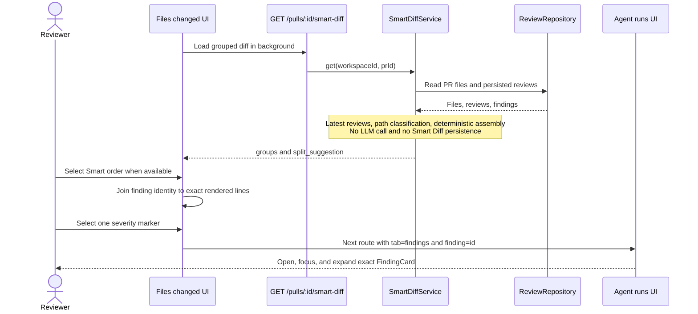

# Smart Diff

Use Smart Diff to review the important parts of a pull request first and open
an existing review finding from its exact changed line. The feature reuses
persisted PR files and review results; requesting Smart Diff does not call an
LLM. (`server/src/modules/smart-diff/service.ts:24-49`,
`server/src/modules/smart-diff/assemble.ts:102-123`,
`server/test/smart-diff.it.test.ts:135-162`)

The package-level route maps remain in the
[client README](../client/README.md#ui-route-map) and
[server README](../server/README.md#api-map-starter).

## Review a pull request

1. Open a PR and select **Files changed**.
2. Keep **Original order** to inspect the persisted file list as loaded. This
   mode is selected on every mount and does not show finding markers.
3. Select **Smart order** when it becomes available. The control stays disabled
   while the response is missing or has no groups, so the original diff remains
   usable.
4. Review **Core logic**, then **Wiring**. Both groups start open.
   **Boilerplate** starts closed and can be expanded manually.
5. Select a lowercase severity marker on a changed line. The application routes
   to `?tab=findings&finding=<id>`, opens the owning review run, and focuses and
   expands that exact `FindingCard` in **Agent runs**.

(`client/src/app/repos/[repoId]/pulls/[number]/_components/DiffTab/DiffTab.tsx:45-52`,
`client/src/app/repos/[repoId]/pulls/[number]/_components/DiffTab/DiffTab.tsx:72-91`,
`client/src/app/repos/[repoId]/pulls/[number]/_components/DiffTab/DiffTab.tsx:128-145`,
`client/src/app/repos/[repoId]/pulls/[number]/_components/SmartDiffViewer/SmartDiffViewer.tsx:76-85`,
`client/src/app/repos/[repoId]/pulls/[number]/_components/SmartDiffViewer/SmartDiffViewer.tsx:103-125`,
`client/src/app/repos/[repoId]/pulls/[number]/_components/DiffTab/helpers.ts:1-4`,
`client/src/app/repos/[repoId]/pulls/[number]/_components/FindingsTab/FindingsTab.tsx:85-105`,
`client/src/app/repos/[repoId]/pulls/[number]/_components/ReviewRunAccordion/ReviewRunAccordion.tsx:57-65`,
`client/src/app/repos/[repoId]/pulls/[number]/_components/FindingsPanel/FindingsPanel.tsx:45-59`,
`client/src/app/repos/[repoId]/pulls/[number]/_components/FindingCard/FindingCard.tsx:48-62`)

## Grouping and order

The server normalizes each path and applies classification precedence in this
order: Boilerplate, Wiring, then the Core fallback. It emits non-empty groups
in the review order Core logic, Wiring, Boilerplate.

| Group | Typical matches | Initial state |
|---|---|---|
| Core logic | Source and business logic that matches no stronger rule | Open |
| Wiring | Package manifests, config/index files, migrations, workflow files, and configuration-oriented extensions | Open |
| Boilerplate | Lockfiles, generated/build/vendor paths, snapshots, minified files, and source maps | Closed |

Within a group, files are ordered by unique finding-line count descending,
changed-line count descending, then path ascending. Finding lines in the API
response are de-duplicated and sorted ascending.

(`server/src/modules/smart-diff/constants.ts:14-18`,
`server/src/modules/smart-diff/constants.ts:20-81`,
`server/src/modules/smart-diff/classify.ts:93-104`,
`server/src/modules/smart-diff/assemble.ts:31-35`,
`server/src/modules/smart-diff/assemble.ts:53-79`)

## Findings on diff lines

Smart Diff displays findings from each agent's latest `kind: "review"` record.
Rows without an agent ID remain independent. Summary reviews, dismissed
findings, and findings absent from the endpoint's authoritative
`finding_lines` are excluded. (`server/src/modules/smart-diff/service.ts:31-47`,
`server/src/modules/pulls/status.ts:33-50`,
`client/src/app/repos/[repoId]/pulls/[number]/_components/SmartDiffViewer/helpers.ts:32-87`)

The client attaches a finding only when `start_line` matches a rendered
new-side diff line. It does not move a finding to a nearby line when a GitHub
patch is incomplete. The passive file count likewise includes only controls
that can actually render. (`client/src/components/diff-viewer/helpers.ts:11-37`,
`client/src/components/diff-viewer/FileCard/FileCard.tsx:65-77`,
`client/src/components/diff-viewer/FileCard/FileCard.tsx:112-137`)

Every finding on the same line remains a separate accessible button. Their
stable order is severity, review time descending, then finding ID. The row tint
uses the worst severity on that line, while the visible button labels preserve
each individual severity. (`client/src/app/repos/[repoId]/pulls/[number]/_components/SmartDiffViewer/helpers.ts:89-105`,
`client/src/components/diff-viewer/CodeLine/CodeLine.tsx:41-48`,
`client/src/components/diff-viewer/CodeLine/CodeLine.tsx:78-95`)

## Size and token indicators

- The summary above the files uses the PR detail's authoritative file,
  addition, and deletion totals rather than recomputing the loaded file subset.
- A file gets orange **Large file** emphasis when
  `additions + deletions > 150` in either mode. This does not change the
  separate rule that files with more than 200 changed lines start collapsed.
- The large-PR banner appears when Core and Wiring exceed 400 changed lines.
  Its displayed total includes all changed files.
- **0 new tokens · built on N from last review** appears only when every selected
  latest review points to a completed run with known input and output token
  counts. Otherwise the entire line is omitted. `0 new tokens` describes the
  Smart Diff request itself; `N` is the de-duplicated sum of those completed
  review runs.

(`client/src/app/repos/[repoId]/pulls/[number]/page.tsx:169-180`,
`client/src/app/repos/[repoId]/pulls/[number]/_components/DiffTab/DiffTab.tsx:107-126`,
`client/src/components/diff-viewer/constants.ts:3-7`,
`client/src/components/diff-viewer/FileCard/FileCard.tsx:60-64`,
`server/src/modules/smart-diff/constants.ts:83-90`,
`server/src/modules/smart-diff/assemble.ts:110-121`,
`client/src/app/repos/[repoId]/pulls/[number]/_components/SmartDiffViewer/helpers.ts:108-139`,
`client/src/app/repos/[repoId]/pulls/[number]/_components/SmartDiffViewer/SmartDiffViewer.tsx:55-73`)

## Request and navigation flow



The route is a thin Fastify handler; the service reads through the existing
review repository, and `classifyPath` plus `assembleSmartDiff` contain the pure
classification and assembly logic. The module is registered statically with
the other server modules. (`server/src/modules/smart-diff/routes.ts:19-30`,
`server/src/modules/smart-diff/service.ts:17-49`,
`server/src/modules/smart-diff/classify.ts:93-104`,
`server/src/modules/smart-diff/assemble.ts:102-123`,
`server/src/modules/index.ts:28-40`)

The response contains:

- `groups[]` with `role` and ordered `files[]`;
- each file's `path`, additions, deletions, and `finding_lines`;
- `split_suggestion` with `too_big`, `total_lines`, and proposed directory
  splits;
- `pseudocode_summary: null` for every file in the current deterministic
  implementation.

(`server/src/vendor/shared/contracts/brief.ts:123-156`,
`server/src/modules/smart-diff/assemble.ts:43-50`,
`server/src/modules/smart-diff/assemble.ts:116-123`)

When a review finishes, the PR page invalidates the Smart Diff query and
refetches reviews, so returning to **Files changed** uses the current persisted
findings. (`client/src/app/repos/[repoId]/pulls/[number]/page.tsx:160-165`)

## Verify the feature

Run the focused client tests and typecheck:

```sh
cd client
pnpm exec vitest run 'src/app/repos/[repoId]/pulls/[number]/_components/SmartDiffViewer' 'src/app/repos/[repoId]/pulls/[number]/_components/DiffTab' src/components/diff-viewer
pnpm typecheck
```

Run the pure server tests, then the Docker-backed route test that also asserts
zero calls to the mock LLM:

```sh
cd server
pnpm exec vitest run test/smart-diff-classify.test.ts test/smart-diff-assemble.test.ts
pnpm exec vitest run test/smart-diff.it.test.ts
pnpm typecheck
```

Run the deterministic browser journey from the repository root:

```sh
./scripts/e2e.sh
```

Flow `09-smart-diff` verifies Original order by default, Smart order opt-in, the
Core logic heading, the exact `src/config.ts:12` marker, an application-route
transition containing `tab=findings&finding=`, and the matching FindingCard.
It does not run a review or use an AI locator.
(`e2e/specs/09-smart-diff.flow.json:1-38`, `e2e/README.md:78-91`)
