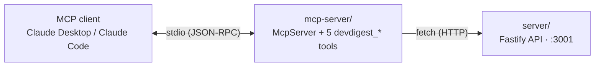

# `@devdigest/mcp-server` — local stdio MCP server

A standalone, local-only package that speaks [MCP](https://modelcontextprotocol.io)
over **stdio** to Claude Desktop / Claude Code. It is a **pure HTTP client** of
the already-running local DevDigest API (`http://localhost:3001` by default) —
no database, no filesystem access to another package's code, no HTTP listener
of its own. It exposes 5 namespaced tools (`devdigest_*`) that let an MCP
client list agents, trigger a review and wait for its result, page through
findings, read a repo's extracted conventions, and — as a deliberate stub —
ask for a PR's blast radius.

## How it fits together



The MCP client spawns `dist/index.js` as a subprocess and talks JSON-RPC over
its stdin/stdout (`src/index.ts:38-39`); `mcp-server` in turn calls the local
DevDigest API over plain `fetch` (`src/api/client.ts:72-197`). **The DevDigest
studio (`./scripts/dev.sh` from the repo root) must already be running on
`:3001`** for every tool except `devdigest_get_blast_radius` — that one makes
no HTTP call at all (`src/tools/get-blast-radius.ts:44-57`).

## The 5 tools

| Tool | Params | `annotations` | Notes |
|---|---|---|---|
| `devdigest_list_agents` | none | `readOnlyHint: true, destructiveHint: false` | Returns `{ id, name, description, enabled, model }` per agent (`src/tools/list-agents.ts:24-30,63`) |
| `devdigest_run_agent_on_pr` | `repo` (owner/name), `pr` (GitHub PR number), `agent` (id or name) | `readOnlyHint: false, destructiveHint: false, idempotentHint: false, openWorldHint: true` | The only mutating tool — one call does resolve → trigger → poll → fetch (`src/tools/run-agent-on-pr.ts:256-261`) |
| `devdigest_get_findings` | `run_id` **or** `repo`+`pr` (mutually exclusive), `response_format?`, `offset?`, `limit?` | `readOnlyHint: true, destructiveHint: false` | Gets the verdict + findings of an already-started run (`src/tools/get-findings.ts:101`) |
| `devdigest_get_conventions` | `repo` | `readOnlyHint: true, destructiveHint: false` | Returns `{ category, rule, evidence_ref, confidence, accepted }` per convention (`src/tools/get-conventions.ts:32-38,71`) |
| `devdigest_get_blast_radius` | `repo`, `pr` (both required) | `readOnlyHint: true, destructiveHint: false` | **Stub** — always `{status:'not_implemented',...}`, makes no HTTP call (`src/tools/get-blast-radius.ts:1-8,42-57`) |

Annotation values above are read verbatim from each tool's `registerTool(...)`
call, not from the plan — see the `file:line` refs in each row.

## Environment

`.env.example` (`mcp-server/.env.example:1-21`); every var is optional, with
the default applied by `loadConfig` (`src/config.ts:30-33`):

| Var | Default | Notes |
|---|---|---|
| `API_BASE_URL` | `http://localhost:3001` | Base URL of the local DevDigest API; a trailing slash is stripped (`src/config.ts:80-82`) |
| `REVIEW_TIMEOUT_MS` | `120000` | Max time `devdigest_run_agent_on_pr` polls before returning `still_running` — described to the model as **"~2 min"**, never "~90s" (`src/config.ts:31`, `src/tools/shared-context.ts:42,46`) |
| `POLL_INTERVAL_MS` | `2000` | Interval between polls of `GET /pulls/:id/runs`; rejected below `1000` (the API's global rate limit is 120 req/min) (`src/config.ts:32,37,75`) |
| `RESOLVE_TIMEOUT_MS` | `20000` | Timeout for the repo/PR/agent resolution HTTP calls (`src/config.ts:33`) |

## Connecting it to an MCP client

Build first (`npm run build`, see [Commands](#commands)), then point the
client at the flat `dist/index.js` the build produces
(`scripts/flatten-dist.mjs:15-18`). Every path below is the **exact** block —
replace `<abs>` with the absolute path to this repo's `mcp-server/` folder.

Claude Desktop / any `mcpServers`-style config:

```json
{"mcpServers":{"devdigest":{"command":"node","args":["<abs>/mcp-server/dist/index.js"],"env":{"API_BASE_URL":"http://localhost:3001"}}}}
```

Claude Code CLI equivalent:

```sh
claude mcp add --transport stdio devdigest -- node <abs>/dist/index.js
```

## Example calls

`devdigest_run_agent_on_pr` — one call does resolve → trigger → poll → fetch
(`src/tools/run-agent-on-pr.ts:250-385`); the returned `findings` use the
**run-result** projection — 9 keys: `severity`, `category`, `title`, `file`,
`start_line`, `end_line`, `rationale`, `suggestion`, `confidence`
(`src/tools/run-agent-on-pr.ts:77-87`):

```json
{"repo": "acme/payments-api", "pr": 482, "agent": "general"}
```

`devdigest_get_findings`, call shape 1 — by `run_id` (the handle a prior
`devdigest_run_agent_on_pr` call in the **same process** returned):

```json
{"run_id": "run_abc123"}
```

`devdigest_get_findings`, call shape 2 — by `repo` + `pr` (no cache needed;
looks up the PR's most recent run, `src/tools/get-findings.ts:181-198`):

```json
{"repo": "acme/payments-api", "pr": 482, "response_format": "detailed", "offset": 25, "limit": 25}
```

The two identifiers are mutually exclusive — passing both, or neither, or
`repo` without `pr`, returns an actionable error naming both accepted call
shapes (`src/schemas.ts:110-151`).

### `response_format`

`devdigest_get_findings` defaults to `'concise'`. Both field lists are the
literal, test-asserted key sets (`src/tools/run-agent-on-pr.ts:57-74`):

- **concise** (default, 7 keys): `severity`, `category`, `title`, `file`,
  `start_line`, `end_line`, `rationale`
- **detailed** (11 keys): the 7 concise keys plus `suggestion`, `confidence`,
  `id`, `review_id` — the two identifiers a caller needs to call the
  server's `POST /findings/:id/accept` / `POST /findings/:id/dismiss`
  endpoints on one specific finding

### Pagination

`offset` defaults to `0`, `limit` defaults to `25` (hard maximum `100`)
(`src/schemas.ts:68-69`). Findings with a non-null `dismissed_at` are
filtered out **before** the `offset`/`limit` slice is taken, in both
`response_format` modes (`src/tools/run-agent-on-pr.ts:110-112`,
`src/tools/get-findings.ts:238-241`). When another page exists, the response
carries a `next_step` naming the exact follow-up call
(`src/tools/get-findings.ts:266-274`).

## The run-id cache is process-lifetime only

`devdigest_run_agent_on_pr` records `run_id → {repoId, prId, agentId, ...}`
in an in-memory `Map` (`src/runs/run-cache.ts:49-79`), capped at 500 entries
with FIFO eviction (`src/runs/run-cache.ts:47`). This cache does **not**
survive an MCP server restart, and a `run_id` from a different process is
always an unrecoverable miss — there is no backend endpoint that resolves a
review by `run_id` alone (`src/runs/run-cache.ts:10-19`).

**Workaround:** a `devdigest_get_findings` cache miss on `run_id` always
leads with the cache-free alternative — call the tool again with `repo` +
`pr` instead, which needs no cache and looks up the PR's most recent run
(`src/tools/get-findings.ts:122-131`). Re-running `devdigest_run_agent_on_pr`
is offered as the second option.

## Commands

From `package.json` (`mcp-server/package.json:7-15`):

| Script | What it does |
|---|---|
| `dev` | `tsx watch src/index.ts` |
| `build` | `tsc -p tsconfig.json` then `node scripts/flatten-dist.mjs` — the flatten step is needed because the `@devdigest/shared` type-only path alias points outside `src/`, which pushes `tsc`'s emit root up; the script copies the real output back to a flat `dist/index.js` (`scripts/flatten-dist.mjs:1-24`) |
| `start` | `node dist/index.js` |
| `typecheck` | `tsc --noEmit -p tsconfig.json` |
| `test` | `vitest run` (both lanes) |
| `test:unit` | `vitest run --exclude "**/*.it.test.ts"` — hermetic, injected fake fetch |
| `test:it` | `vitest run .it.test.ts` — drives the real MCP server over `InMemoryTransport` against a real loopback HTTP stub |

## Testing

See [Commands](#commands) above and [`../TESTING.md`](../TESTING.md) for the
repo-wide strategy.
