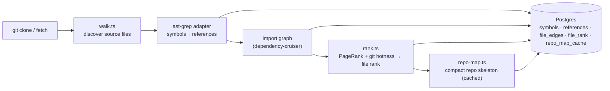

# `repo-intel` — the codebase indexer

`repo-intel` reads a cloned repository **once on clone** (and incrementally on
fetch, keyed by file content hash) and turns it into queryable facts: symbols,
the import graph, a PageRank-based file importance score, and a compact **repo
map** (the project skeleton). On a review it is only **read** — the index is
already computed, so adding context to a prompt costs no analysis at request time.

Product features build on this index through the `RepoIntel` facade rather than
re-indexing or reading its tables directly. The facade is the public boundary
for Blast Radius, review context, conventions, onboarding, and phantom-symbol
checks (`types.ts:182-223`).

## Pipeline

Full vs incremental indexing lives in `pipeline/{full,incremental}.ts`; an
unindexed or partially-indexed repo degrades gracefully (the facade returns empty
results rather than throwing).

## Facade (`repoIntel.*`)

Everything downstream reads through one facade (`service.ts`) so consumers never
touch the pipeline internals:

- `getRepoMap(repoId)` → the cached repo skeleton (fed into the **review prompt**).
- `getFileRank(repoId, files)` → importance percentile per changed file.
- `getCallerSignatures(repoId, files, limit)` → callers of changed symbols.
- `getBlastRadius(repoId, files)` → changed symbols and their resolved,
  rank-ordered callers (`service.ts:221-305,307-412`).
- `getReverseImpact(repoId, files)` → reverse import-graph reachability plus
  endpoint/cron facts, bounded by `BFS_DEPTH` (`service.ts:725-862`).
- `getUnresolvedReferences(repoId, …)` → phantom-symbol detection (used by L06).
- `getConventionSamples(repoId)` → top-ranked files for convention extraction (L02).

The Blast Radius service checks `getIndexState` before calling
`getBlastRadius` and `getReverseImpact`, then assembles the route response
without reaching into this module's repository (`../blast/service.ts:65-99`).
The reverse walk reads importers and file facts from the persisted index
(`repository.ts:539-570`); it does not rebuild the graph for each request.

Review context separately uses `getCallerSignatures`, `getRepoMap`, and
`getFileRank` (`../reviews/run-executor.ts:440,473,496`). Those reads remain
controlled by `REPO_INTEL_ENABLED` and the per-agent `repo_intel` flag.

## Routes

- `GET /repos/:id/index-state` — index status (drives the **Indexed** badge).
- `POST /repos/:id/resync` — enqueue a re-index.
