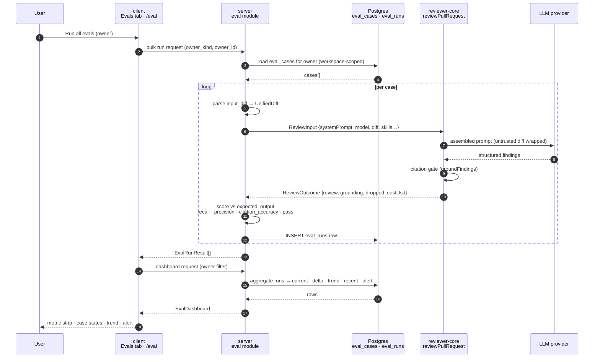

# Spec: Eval Pipeline
Spec ID: SPEC-2026-09-01-eval-pipeline
Status: approved
Supersedes: —
Related: —

## Problem & user

DevDigest lets a user tune a reviewer agent (model, system prompt, skills) and
a skill body, but gives no way to tell whether an edit made the reviewer
*better or worse*. Today the only feedback is anecdotal: run a review on a PR,
eyeball the findings. Every agent config change is versioned
(`agent_versions`, snapshotted by `PUT /agents/:id` — see
`server/src/modules/agents/routes.ts:111-120` and the `AgentVersionConfig`
contract, `server/src/vendor/shared/contracts/knowledge.ts:239`), yet nothing
measures those versions against each other.

**User:** the person maintaining reviewer agents/skills in the Skills Lab
(the studio's single local operator). They need a regression harness: a set of
frozen "this diff must produce this finding" cases, a mechanical score, and a
trend so a prompt edit that quietly loses a critical detection is caught before
it ships to CI.

The DB tables and Zod contracts for this already exist and are frozen:
`eval_cases` / `eval_runs` (`server/src/db/schema/eval.ts:7-35`, already
created in `server/src/db/migrations/0000_init.sql:116-140` with FKs at
`:376-377`), `EvalRun` / `EvalCase` / `EvalOwnerKind` / `EvalPerTrace`
(`server/src/vendor/shared/contracts/knowledge.ts:50-84`), and `EvalCaseInput`
/ `EvalRunRecord` / `EvalRunResult` / `EvalTrendPoint` / `EvalDashboard`
(`server/src/vendor/shared/contracts/eval-ci.ts:20-89`). Nothing exposes them:
there is no `eval` module in the registry
(`server/src/modules/index.ts:31-47`), the agent editor has no Evals tab
(`client/src/app/agents/[id]/_components/AgentEditor/constants.ts:11-15` —
"later lessons add Evals/Stats/CI"), the skill editor likewise
(`client/src/app/skills/[id]/_components/SkillEditor/constants.ts:10`), and
`/eval` is an explicit placeholder owned by "a future phase"
(`client/src/app/eval/page.tsx:3-13`). This spec is that phase.

## Recommendations

Advice to accept or reject; not folded into Goals or Acceptance criteria.

- **R-1 — Make the "Recent runs" table per-case in v1, not per-batch.** Every
  mockup run table (`screenshot-03.png`, `screenshot-02.png`,
  `screen_skills-eval-dashboard-compare-modal.jsx:462-475`) shows one row per
  *batch* ("17/20 pass", one `version`, one `$0.23` cost). The frozen schema
  stores one `eval_runs` row per *case* (`eval.ts:22-35` — `case_id`, no batch
  id, no version column) and `EvalDashboard.recent_runs` is
  `z.array(EvalRunRecord)`, i.e. per-case records
  (`eval-ci.ts:33-46,86`). Rather than reconstructing batches from a `ran_at`
  proximity window — which this repo already regrets doing for the run-cost
  badge (`server/INSIGHTS.md:57-58`, "Should PR-list COST use a real batch id
  instead of a `ran_at` time-window heuristic?") — I'd ship a contract-honest
  per-case runs table first and treat batches/versions as a follow-up once
  there's a real grouping column to hang them on. This also removes the
  "Version" column and the `v6 → v7` framing from the compare modal, replacing
  it with "compare any two runs of this case". See OQ-1/OQ-2.
  **Decision: Accepted** — see AC-46.
- **R-2 — Seed the eval case's `input_diff` server-side from a file-scoped
  slice of the PR diff, not client-side from the finding alone.** The mockup's
  `findingToSeed`
  (`specs/design-references/eval-pipeline/findings-turn-into-eval-case-button.jsx:30-46`)
  builds a seed with `file`, `line`, `title`, `assertion`, `expected` — but no
  `input_diff` at all, and an eval case without a diff can't be run
  (`EvalCaseInput.input_diff`, `eval-ci.ts:24`). The server already holds the
  PR's diff and `reviewer-core` already exports `sliceDiff`
  (`reviewer-core/src/index.ts:39`) for narrowing a diff to one file. Slicing
  to the finding's file yields a cheaper, more focused, more stable case than
  freezing the entire PR diff.
  **Decision: Accepted** — folded into AC-27.

## Goals / Non-goals

- **G-1** — Manage eval cases: create, list, read, update and delete cases for
  one owner (`owner_kind` ∈ {`skill`,`agent`} × `owner_id`) inside a
  workspace, on the existing `eval_cases` table and `EvalCaseInput`/`EvalCase`
  contracts.
- **G-2** — Run one eval case, or every case of one owner, against the owner's
  current configuration; score it mechanically and persist one `eval_runs` row
  per case run, returning `EvalRunResult`.
- **G-3** — Serve an `EvalDashboard` aggregate (current metrics, delta vs the
  previous data point, trend, recent runs, regression alert) filtered by owner
  or workspace-wide.
- **G-4** — Give the agent detail page and the skill detail page an "Evals"
  tab: metric summary, case list with pass / fail / never-run status,
  per-case run + edit + delete controls, "Run all evals" and "New eval case".
- **G-5** — Let a user turn an existing finding into a seeded eval case from
  `FindingCard`, without adding a member to the frozen `FindingActionKind`
  enum (`server/src/vendor/shared/contracts/findings.ts:82`).
- **G-6** — Replace the `/eval` placeholder with the real Eval Dashboard:
  cross-owner overview, per-owner detail (alert banner, metric cards, trend
  chart, selectable recent-runs table) and a "Compare runs" modal showing
  metric deltas plus a system-prompt diff sourced from the existing agent
  version history.
- **G-7** — Confirm the DB is already in the required shape: no hand-written
  migration, no new columns.

**Non-goals** (each is a separate L06-family feature with its own contracts in
the same file — describing them here would violate one-spec-one-feature):

- Compose review — `ComposeReviewInput` / `ComposedReview` /
  `ComposeReviewPreview` (`eval-ci.ts:95-127`) and the `composed_reviews`
  table (`eval.ts:47-56`).
- Export to CI and CI run ingestion — `CiTarget` / `CiFile` /
  `AgentManifest` / `CiExportInput` / `CiInstallation` / `CiExport` / `CiRun`
  / `CiResultArtifact` (`eval-ci.ts:133-247`), the `ci_installations` /
  `ci_runs` tables, and the mockup's CI tab
  (`screen_agents-evals-tab.jsx:121-160`).
- Conformance checking — `ConformanceInput` / `ConformanceReport`
  (`eval-ci.ts:254-268`) and the `conformance_checks` table (`eval.ts:37-45`).
- Secret-leak / phantom hooks — `HookKind` / `HookScanResult`
  (`eval-ci.ts:274-283`).
- Plan Verifier (the fourth L06 item in `README.md:88`).
- Any change to `eval_cases` / `eval_runs` columns, to
  `server/src/vendor/shared/**` or `client/src/vendor/shared/**`, to
  `server/src/db/migrations/**`, or to `reviewer-core/src/grounding.ts` — all
  do-not-touch (root `CLAUDE.md`, `server/CLAUDE.md`,
  `reviewer-core/CLAUDE.md`).
- Agent/skill **Stats** tabs (`screen_agents-evals-tab.jsx:83-119`) — adjacent
  in the mockup, unrelated to evals.

## User stories

- As an agent maintainer, after editing the Security Reviewer's system prompt,
  I click **Run all evals** on the Evals tab and see within one screen whether
  any previously-passing case now fails.
- As a reviewer of AI output, when I dismiss a false-positive finding on a PR I
  click **Turn into eval case** so that exact diff becomes a permanent
  "must NOT comment here" regression case.
- As the person deciding whether to keep a prompt change, I select the two runs
  either side of it on `/eval`, hit **Compare**, and read the metric deltas
  next to the prompt diff that caused them.

## Acceptance criteria (EARS)

### Eval case management (server)

- **AC-1 (satisfies G-1):** WHEN a client submits a valid `EvalCaseInput`
  (`eval-ci.ts:20-29`) to the eval-case creation route, the system shall
  persist one `eval_cases` row bound to the caller's resolved workspace and
  return the created case in the `EvalCase` shape
  (`knowledge.ts:73-83`).
- **AC-2 (satisfies G-1):** WHEN a client lists eval cases with an
  `owner_kind` + `owner_id` filter, the system shall return only the cases of
  the caller's workspace matching that owner, and WHEN no filter is supplied
  it shall return every case of the caller's workspace.
- **AC-3 (satisfies G-1):** IF a create or update request carries an
  `owner_id` that is not a UUID, or that does not resolve to an agent (for
  `owner_kind: 'agent'`) or a skill (for `owner_kind: 'skill'`) in the
  caller's workspace, THEN the system shall reject the request with a
  validation or not-found error and persist nothing — `eval_cases.ownerId` is
  a bare `uuid` with no foreign key (`eval.ts:13`), so the route is the only
  place this can be enforced.
- **AC-4 (satisfies G-1):** WHEN a client updates or deletes an eval case that
  belongs to another workspace, or that does not exist, the system shall
  return a not-found error and leave stored data unchanged.
- **AC-5 (satisfies G-1):** WHEN an eval case is deleted, the system shall
  delete its `eval_runs` rows with it, via the existing
  `eval_runs_case_id_eval_cases_id_fk … ON DELETE cascade`
  (`0000_init.sql:377`).
- **AC-6 (satisfies G-1, G-4):** WHILE the `eval` module is registered in
  `server/src/modules/index.ts`, every eval route named in this spec shall be
  reachable over HTTP without any other module being modified.

### Running and scoring (server + reviewer-core)

- **AC-7 (satisfies G-2):** WHEN a client requests a run of one eval case, the
  system shall execute the case's owner configuration against a `UnifiedDiff`
  parsed from the case's `input_diff`, persist exactly one `eval_runs` row
  carrying `actual_output`, `pass`, `recall`, `precision`,
  `citation_accuracy`, `duration_ms` and `cost_usd` (`eval.ts:22-35`), and
  respond with `EvalRunResult` (`eval-ci.ts:49-53`).
- **AC-8 (satisfies G-2):** The system shall score a run without any LLM call
  in the scorer, counting a produced finding as matching an expected finding
  only when the `file` values are identical and the
  `[start_line, end_line]` ranges overlap — the rule the mockup states
  verbatim ("Scoring is mechanical — a finding counts when file matches and
  line ranges overlap. No model call in the scorer.",
  `screen_agents-evals-tab.jsx:190-192`).
- **AC-9 (satisfies G-2):** The system shall compute `recall` as
  (expected findings matched ÷ expected findings total) and `precision` as
  (produced findings matched ÷ produced findings total), each clamped to the
  `0..1` range required by `EvalRun` (`knowledge.ts:59-61`).
- **AC-10 (satisfies G-2):** The system shall derive `citation_accuracy` from
  the citation gate the engine already applies — `kept ÷ (kept + dropped)` as
  reported by `reviewPullRequest`'s `grounding` / `dropped` outputs
  (`reviewer-core/src/review/run.ts:228-241`, produced by `groundFindings`,
  `reviewer-core/src/grounding.ts:52`) — and shall not re-implement or relax
  that gate.
- **AC-11 (satisfies G-2):** WHEN both `recall` and `precision` equal 1 for a
  run, the system shall persist `pass = true`; otherwise it shall persist
  `pass = false`.
- **AC-12 (satisfies G-2):** IF a case's stored `expected_output` cannot be
  read as a JSON array of finding-shaped objects (each with at least `file`,
  `start_line`, `end_line`), THEN the system shall fail that case's run with a
  validation error and persist no `eval_runs` row for it.
- **AC-13 (satisfies G-2, G-4):** WHEN a client requests a bulk run for one
  owner, the system shall run every eval case of that owner and persist one
  `eval_runs` row per case that completed.
- **AC-14 (satisfies G-2):** IF one case in a bulk run fails (LLM error,
  provider quota, unparseable diff), THEN the system shall continue running
  the remaining cases and report that case as errored rather than aborting
  the batch.
- **AC-15 (satisfies G-2):** WHILE a single-case or bulk run is in flight for
  an owner, the client shall show run progress and refuse to start a second
  run for the same owner.

### Dashboard aggregate (server)

- **AC-16 (satisfies G-3):** WHEN a client requests the eval dashboard for a
  given `owner_kind` + `owner_id`, the system shall return an `EvalDashboard`
  (`eval-ci.ts:68-88`) whose `current` reflects that owner's most recent run
  data, `delta` the change against the preceding data point, `trend` an
  `EvalTrendPoint` array in chronological order, and `recent_runs` the most
  recent `EvalRunRecord` rows.
- **AC-17 (satisfies G-3):** WHEN a client requests the eval dashboard with no
  owner filter, the system shall return the workspace-wide aggregate with
  `owner_kind` and `owner_id` set to `null` (`eval-ci.ts:69-70`).
- **AC-18 (satisfies G-3, G-6):** IF the latest `current` metrics show a drop
  against the preceding data point, THEN the system shall return a non-null
  `alert` string naming the regressed metric and its magnitude; otherwise
  `alert` shall be `null`.
- **AC-19 (satisfies G-3):** IF the requested owner has no `eval_runs` rows at
  all, THEN the system shall return a well-formed `EvalDashboard` with zeroed
  `current`, zeroed `delta`, empty `trend`, empty `recent_runs` and
  `alert: null`, rather than an error.

### Evals tab (client)

- **AC-20 (satisfies G-4):** WHERE the agent detail page or the skill detail
  page is open on its Evals tab, the client shall render a metric strip of
  Recall, Precision, Citation accuracy and Traces passed, each with its delta
  where one exists, above the owner's eval-case list
  (`screenshot-05.png`).
- **AC-21 (satisfies G-4):** The Evals tab shall render every eval case of the
  owner with its name, its expected-vs-actual summary line, and exactly one of
  three states — passing, failing, or never run (`screenshot-05.png` shows all
  three: `stripe-key-leak` "expected 1 finding, got 1",
  `missing-retry-after` "expected 1 finding, got 0",
  `service-role-in-client` "never run").
- **AC-22 (satisfies G-4):** WHEN the user activates a case's run control, the
  client shall run that single case and update that row's state and the metric
  strip from the response, without re-running any other case.
- **AC-23 (satisfies G-4):** WHEN the user activates "Run all evals", the
  client shall trigger the owner's bulk run and refresh the metric strip and
  every case's state when it completes.
- **AC-24 (satisfies G-4):** WHEN the user activates "New eval case" or a
  case's edit control, the client shall open an eval-case editor exposing
  Name, an Input section with Diff / Files / PR meta views mapping to
  `input_diff` / `input_files` / `input_meta`, and an Expected output editor
  (`screenshot-06.png`).
- **AC-25 (satisfies G-4):** IF the Expected output text in the editor is not
  valid JSON, THEN the client shall mark it invalid and block saving
  (`screenshot-06.png` shows the converse "valid JSON" state).
- **AC-26 (satisfies G-4):** WHERE the editor's "Run on save" control is
  enabled, the client shall run the case immediately after a successful save
  and display that run's outcome in the editor
  ("Last run passed · expected 1 finding, got 1 · 1.8s · $0.02",
  `screenshot-06.png`).

### Finding → eval case (client + server)

- **AC-27 (satisfies G-5):** WHEN the user activates "Turn into eval case" on
  an expanded `FindingCard`, the client shall request a seed from the server
  and open the eval-case editor pre-filled with it — name derived from the
  finding title, expected output derived from the finding, and `input_diff`
  computed server-side as the PR diff sliced to the finding's file via
  `reviewer-core`'s `sliceDiff` (`reviewer-core/src/index.ts:39`), not
  assembled client-side from the finding alone — alongside the existing Accept
  and Dismiss controls
  (`client/src/app/repos/[repoId]/pulls/[number]/_components/FindingCard/FindingCard.tsx:98-119`;
  `screenshot-01-eval-dashboard-overview.png` shows the row as
  Accept · Dismiss · Learn · Turn into eval case · Reply to author).
- **AC-28 (satisfies G-5):** WHERE the finding being seeded is already
  dismissed, the system shall seed a negative case — an empty expected-output
  array meaning "the agent must produce no finding here" — and where it is not
  dismissed, a positive "must find" case
  (`findings-turn-into-eval-case-button.jsx:30-46`).
- **AC-29 (satisfies G-5):** The seeding capability shall be exposed as its
  own action and route, and shall not add any member to `FindingActionKind`
  (`findings.ts:82`), which is a frozen vendored contract and stays
  `['accept','dismiss','learn','reply']`.
- **AC-30 (satisfies G-5):** IF the finding's review has no resolvable owning
  agent — `reviews.agentId` is nullable and deliberately FK-less
  (`server/src/db/schema/reviews.ts:30`, `:97-98`) — THEN the system shall
  require the user to choose an owner before the case can be saved, rather
  than persisting a case with a dangling `owner_id`.

### Eval Dashboard page (client)

- **AC-31 (satisfies G-6):** WHEN a user opens `/eval`, the client shall render
  the cross-owner overview — one row per agent/skill with its latest run
  timestamp, pass count and Recall / Precision / Citation figures — instead of
  the current `FeaturePlaceholder` (`client/src/app/eval/page.tsx:5-14`;
  `screenshot-02.png`).
- **AC-32 (satisfies G-6):** WHEN the user selects one owner from the overview,
  the client shall render that owner's detail view containing the regression
  alert banner (when `alert` is non-null), a metric card per metric with its
  delta and sparkline, the metric trend chart, and the recent-runs table
  (`screenshot-03.png`).
- **AC-33 (satisfies G-6):** WHERE exactly two runs are selected in the
  recent-runs table, the client shall enable "Compare"; otherwise it shall
  keep it disabled and show the "Select two runs to compare" hint
  (`screen_skills-eval-dashboard-compare-modal.jsx:456-460`).
- **AC-34 (satisfies G-6):** WHEN the user opens the compare modal for two
  selected runs, the client shall show the per-metric old → new deltas for
  Recall, Precision, Citation and Cost, and a system-prompt diff built from
  the two corresponding agent config snapshots read through the existing
  `GET /agents/:id/versions` and `GET /agents/:id/versions/:version`
  (`server/src/modules/agents/routes.ts:129-145`) — no new version storage
  (`screenshot-04.png`).
- **AC-35 (satisfies G-6):** The Eval Dashboard shall be reachable from the
  existing SKILLS LAB → "Eval Dashboard" nav entry
  (`client/src/vendor/ui/nav.ts:35`) with no change to that vendored nav
  definition.

### Schema verification

- **AC-36 (satisfies G-7):** The `eval_cases` and `eval_runs` tables shall
  remain fully represented by `server/src/db/migrations/0000_init.sql:116-140`
  and its FK constraints at `:376-377`, such that running `drizzle-kit
  generate` (`pnpm db:generate`) after this feature produces no new SQL for
  either table and no migration file is hand-written — consistent with
  `server/INSIGHTS.md:31-32` ("Don't hand-write migrations; edit `schema/*.ts`
  and run `pnpm db:generate`") and the do-not-touch rule on
  `server/src/db/migrations/`.

### Resolutions (one AC per resolved open question, OQ-1…OQ-12)

- **AC-37 (resolves OQ-3a, satisfies G-2):** WHEN a case's `expected_output`
  is an empty array AND the run produces zero findings, the system shall
  persist `recall = 1`, `precision = 1`, `pass = true` — a negative case with
  nothing wrongly flagged is a passing result, not an undefined one.
- **AC-38 (resolves OQ-3b, satisfies G-2):** IF `kept + dropped` from the
  engine's grounding report (AC-10) is `0` (the run produced no findings at
  all), THEN the system shall persist `citation_accuracy = null` in
  `eval_runs`/`EvalRunRecord` (both nullable, `eval.ts:32`, `eval-ci.ts:41`)
  and, because `EvalRunResult.result` (`EvalRun`) requires a number in
  `0..1` with no null allowed (`knowledge.ts:61`), the single-run response
  shall report `citation_accuracy = 1` for that same case — "nothing to
  ground" is vacuously accurate — while the persisted/dashboard-facing value
  stays `null` and is excluded from trend/average calculations.
- **AC-39 (resolves OQ-5, satisfies G-1, G-3, G-4):** The system shall never
  cascade-delete `eval_cases` when their owning agent or skill is deleted.
  WHERE an eval case's `owner_id` no longer resolves to an agent or skill in
  the workspace, the Evals tab and the Eval Dashboard shall mark it "Owner
  deleted", exclude it from any "Run all evals" / "Run all agents" bulk
  action, and still show it (read-only) in the case list and run history.
- **AC-40 (resolves OQ-9, satisfies G-2):** `pass` shall default to
  `recall = 1 AND precision = 1` (AC-11) for every case in v1. A per-case
  override threshold MAY later be read from the existing `eval_cases.input_meta`
  jsonb column (e.g. `{ "pass_threshold": { "recall": 0.8 } }`) without a
  schema change; this spec does not require the override UI to ship in v1.
- **AC-41 (resolves OQ-10, satisfies G-6):** WHEN the user activates "Promote"
  on a compared run's version in the compare modal, the client shall ask for
  confirmation and then call the existing `PUT /agents/:id`
  (`agents/routes.ts:111-120`) with that version's `AgentVersionConfig`
  snapshot as the update body — creating a new, newest `agent_versions` row
  whose config matches the promoted snapshot, rather than any new
  "rollback"/pointer-move endpoint.
- **AC-42 (resolves OQ-11, satisfies G-4):** WHERE the Evals tab is open for
  a skill, the client shall run that skill's eval cases through whichever
  currently-enabled agent has the skill linked (via the existing agent↔skill
  link) as the run's `systemPrompt`/`model` source. IF the skill is linked to
  no enabled agent, THEN the tab shall disable "Run"/"Run all evals" and show
  "Link this skill to an agent to run its evals."
- **AC-43 (resolves OQ-12, satisfies G-6):** WHEN the user activates "Run all
  agents" on the Eval Dashboard overview, the client shall show a
  confirmation naming the number of LLM calls the action will make (sum of
  eval cases across all owners) before issuing the bulk request.
- **AC-44 (resolves OQ-8, clarifies AC-8, satisfies G-2):** A produced finding
  shall be scored as matching an expected finding when `file` and overlapping
  `[start_line, end_line]` agree (AC-8); `severity` and `category` shall NOT
  be required to match for scoring purposes — a mismatch on either is
  surfaced in the run detail as an informational diff only.
- **AC-45 (resolves OQ-6, clarifies AC-21, satisfies G-4):** The Evals tab's
  "N / M passing" count shall use `M` = every eval case belonging to the
  owner, including never-run cases; never-run cases shall count toward `M`
  but neither toward passing nor toward failing.
- **AC-46 (resolves OQ-1 + OQ-2, satisfies G-3, G-6):** Per R-1, the
  recent-runs table (Evals tab and Eval Dashboard alike) shall list one row
  per `eval_runs` record (no batch reconstruction from a `ran_at` window).
  Each row shall show an inferred agent-version label, computed by matching
  the run's `ran_at` to the latest `agent_versions` snapshot whose
  `created_at` is at or before it (`GET /agents/:id/versions`,
  `agents/routes.ts:129-133`) — no new column, no batch id.
- **AC-47 (resolves OQ-4, satisfies G-2):** A bulk run (one owner's full case
  set, or "Run all agents" workspace-wide) shall be asynchronous: the
  triggering request shall return immediately with a run-in-progress handle,
  and the client shall poll for completion, following the existing
  `POST /pulls/:id/review` pattern (`server/INSIGHTS.md:47-48`) rather than
  holding one long-lived request open.
- **AC-48 (resolves OQ-7, clarifies AC-9, satisfies G-2):** A "trace" is one
  expected finding within a case's `expected_output`, not the case itself:
  `traces_total` shall equal the count of entries in `expected_output`, and
  `traces_passed` shall equal the count of those matched by a produced
  finding under AC-8/AC-44's rule.

## Edge cases

- **Owner deleted, cases orphaned.** `eval_cases.ownerId` has no FK
  (`eval.ts:13`; the only FK is `workspace_id`, `0000_init.sql:376`). Deleting
  an agent or skill leaves its eval cases behind, and the dashboard would list
  an owner that no longer exists. See OQ-5.
- **`input_diff` nullable in the DB, non-nullable in the contract.** The
  column is `text('input_diff')` with no `.notNull()` (`eval.ts:15`), while
  `EvalCase.input_diff` is `z.string()` (`knowledge.ts:78`) and
  `EvalCaseInput.input_diff` defaults to `''` (`eval-ci.ts:24`). Rows written
  outside the API (seed data) can hold `NULL`; the read path must normalize it
  or the response fails contract validation.
- **Empty diff / diff that parses to zero hunks.** Every finding then fails
  the citation gate (`grounding.ts:61-62`, "file not present in diff"), so
  `recall` is 0 for a positive case, and a negative case trivially passes.
- **Zero expected findings and zero produced findings** (the
  `clean-refactor-no-flags` case, `screenshot-05.png`): both recall and
  precision are 0 ÷ 0. The mockup shows this as passing, so the convention
  must be defined rather than left to floating-point NaN. See OQ-3.
- **Zero produced findings on a positive case:** precision is 0 ÷ 0 while
  recall is 0 — the run must still be `pass = false`.
- **Citation accuracy when the model produced nothing:** `kept + dropped` is
  0, so `kept ÷ (kept + dropped)` is undefined. See OQ-3.
- **Grounding is applied inside the engine.** `reviewPullRequest` returns only
  the findings that survived the gate (`run.ts:239`). Scoring
  `citation_accuracy` by re-running `groundFindings` over the engine's output
  would always yield 1.0; the number must come from the engine's own
  `grounding`/`dropped` report (`run.ts:228-241`), which AC-10 pins down.
- **Runs are asynchronous elsewhere in this codebase.** `POST
  /pulls/:id/review` returns before the review exists
  (`server/INSIGHTS.md:47-48`). `EvalRunResult` (`eval-ci.ts:49-53`) carries a
  materialized `result`, implying the eval run path resolves before
  responding — a bulk run over 20 cases is therefore a long request. See OQ-4.
- **Cost of a bulk run.** "Run all agents" on the overview
  (`screenshot-02.png`) fans out to every owner × every case, each an LLM
  call, against the user's own API key.
- **Contradiction in the mockup's pass-count denominator.** The Evals tab jsx
  computes `pass + " / " + ran` where `ran` excludes never-run cases
  (`screen_agents-evals-tab.jsx:182-183,195`), which for the screenshot's data
  (3 pass, 1 fail, 1 never-run) is "3 / 4"; the rendered screenshot instead
  shows "3 / 5 passing" (`screenshot-05.png`). See OQ-6.
- **A finding whose file no longer appears in the seeded diff** (R-2's slice
  produced nothing, e.g. a full-file `kind` finding such as `secret_leak`,
  which grounds differently — `grounding.ts:16,66-70`): the seeded case would
  be unrunnable and must be rejected at seed time, not at run time.
- **Two owners, one workspace-wide trend.** Workspace-wide `current`
  (AC-17) mixes owners with different case counts; a new owner with two cases
  can move the workspace average more than a mature owner with twenty.

## Workflow & communication

Client (Next.js, `:3000`) → server (Fastify, `:3001`) → `reviewer-core` (pure,
in-process via tsconfig path alias) → LLM. `reviewer-core` performs no I/O
beyond the injected provider (`reviewer-core/src/index.ts:1-12`), so the server
resolves the owner's config and the case row before calling in, and owns all
persistence.

**Contracts exchanged** (all pre-existing; none introduced by this spec):

| Direction | Shape | Source |
|---|---|---|
| client → server | `EvalCaseInput` | `eval-ci.ts:20-29` |
| server → client | `EvalCase` | `knowledge.ts:73-83` |
| server → client | `EvalRunResult` (wraps `EvalRun`) | `eval-ci.ts:49-53`, `knowledge.ts:58-67` |
| server → client | `EvalRunRecord` | `eval-ci.ts:33-45` |
| server → client | `EvalDashboard` (wraps `EvalTrendPoint`, `EvalRunRecord`) | `eval-ci.ts:57-88` |
| server → client | `AgentVersion` / `AgentVersionConfig` (compare modal's prompt diff) | `knowledge.ts:239+` via `agents/routes.ts:129-145` |
| server → reviewer-core | `ReviewInput` → `ReviewOutcome` | `reviewer-core/src/review/run.ts:59,118` |

Both mirrored copies of the contracts (`server/src/vendor/shared/` and
`client/src/vendor/shared/`) already carry these shapes and are read as fixed
ground truth — they are do-not-touch and are not synced automatically
(`server/CLAUDE.md`, `client/CLAUDE.md`).

## Non-functional requirements

- **Performance:** the dashboard aggregate shall answer in well under a second
  for a workspace's full run history without an N+1 query per case (verify:
  seed a workspace with ~20 cases × ~50 runs and time the dashboard endpoint;
  check the query count in the integration test).
- **Cost control:** a bulk run's cost shall be attributable — every
  `eval_runs` row records its own `cost_usd` (`eval.ts:34`) — and the UI shall
  state the number of LLM calls a bulk action will make before it starts
  (verify: run a bulk eval with a stubbed provider and assert one persisted
  `cost_usd` per case).
- **Security (prompt injection):** eval-case `input_diff` is user-pasted text
  that reaches an LLM, and shall travel the same hardened path as a real PR
  diff — wrapped by `wrapUntrusted` under `INJECTION_GUARD`
  (`reviewer-core/src/prompt.ts:16-33`) rather than concatenated into the
  system prompt (verify: unit-test that an assembled eval prompt contains the
  `<untrusted source=…>` wrapper around the case diff).
- **Security (workspace isolation):** every eval route shall scope reads and
  writes to the caller's resolved workspace, as the existing modules do via
  `getContext` (`server/src/modules/agents/routes.ts:77`) (verify: an
  integration test asserting a case created in workspace A is invisible and
  un-deletable from workspace B).
- **Reliability:** a failing case shall not lose the results of the cases that
  already succeeded in the same batch (verify: integration test with a
  provider stub that throws on the second of three cases; assert two persisted
  rows and an error entry for the third).
- **Observability:** each persisted run shall record `duration_ms`,
  `cost_usd` and the full `actual_output` (`eval.ts:29-35`) so a regression can
  be diagnosed after the fact without re-running (verify: inspect a persisted
  row after a run and confirm all three are non-null on the success path).
- **Accessibility:** the compare-runs modal and the eval-case editor shall be
  operable by keyboard with focus trapped in the dialog and a labelled close
  control (verify: keyboard-only walkthrough of open → select → compare →
  close; existing client test conventions in `client/`).

## Inputs and provenance

- **Eval case content** — authored by the user in the eval-case editor
  (`screenshot-06.png`), or seeded from an existing finding plus that PR's
  stored diff (AC-27). Persisted in `eval_cases`.
- **Owner configuration at run time** — the agent's current `provider`,
  `model`, `system_prompt` and linked skills, read from the existing agents
  module; skill bodies resolved by the server before reviewer-core is called
  (`reviewer-core/src/review/run.ts:29-31`).
- **Actual output** — produced by the LLM through `reviewPullRequest` and
  passed through the citation gate before it is scored or stored.
- **Metrics** — computed by the server's scorer from expected vs actual; the
  `citation_accuracy` input comes from the engine's own grounding report
  (`run.ts:228-241`).
- **Dashboard figures** — derived exclusively from persisted `eval_runs` rows;
  nothing on the dashboard is model-generated.
- **System-prompt diff in the compare modal** — the immutable
  `agent_versions` snapshots already written on every config change
  (`knowledge.ts:234-238`), read via `agents/routes.ts:129-145`.

## Untrusted inputs

- **`input_diff`** — arbitrary user-supplied text that becomes part of an LLM
  prompt. Handled by the existing injection hardening: wrapped in
  `<untrusted source=…>` with the closing delimiter escaped, under the
  `INJECTION_GUARD` preamble (`reviewer-core/src/prompt.ts:16-33`). No new
  mechanism.
- **`expected_output` / `input_files` / `input_meta`** — arbitrary JSON stored
  as `jsonb` (`eval.ts:17-18`) and typed `z.unknown()` in the contracts
  (`eval-ci.ts:25-27`). It is never executed and never sent to the model; it
  is only compared field-by-field by the scorer, which must validate the shape
  first (AC-12) rather than trusting it.
- **Case `name` and `notes`** — user text rendered in the UI; React's JSX
  escaping applies, and neither is interpolated into a prompt.
- **Findings-derived seeds** — a finding's `title`/`file` originate from the
  LLM, so seeded case names and expected values are model-derived text and get
  the same treatment as any other user-editable field (the user reviews the
  seed in the editor before saving, AC-27).

## Decisions

All twelve open questions raised during drafting are resolved below; each
decision is backed by a concrete acceptance criterion (AC-37…AC-48) so
nothing here is aspirational. No `[NEEDS CLARIFICATION]` markers remain.

- **OQ-1 — Resolved:** version is not stored; it's inferred per run by
  matching `ran_at` against `agent_versions` timestamps (option b). See
  AC-46.
- **OQ-2 — Resolved:** no batch grouping — the runs table stays per-case
  (R-1, accepted). See AC-46.
- **OQ-3 — Resolved:** degenerate recall/precision (0 ÷ 0) persist as `1`
  (vacuously passing); degenerate `citation_accuracy` persists as `null` in
  storage and reports `1` in the single-run response contract, which cannot
  hold `null`. See AC-37, AC-38.
- **OQ-4 — Resolved:** bulk runs are asynchronous with client polling,
  matching the existing PR-review pattern. See AC-47.
- **OQ-5 — Resolved:** no cascade delete. Orphaned cases are marked "Owner
  deleted", excluded from bulk runs, and kept visible for history. See
  AC-39.
- **OQ-6 — Resolved:** the design's rendered screenshot is authoritative —
  the passing-count denominator is every case for the owner, including
  never-run ones. See AC-45.
- **OQ-7 — Resolved:** a trace is one expected finding inside a case's
  `expected_output`, not the case itself. See AC-48.
- **OQ-8 — Resolved:** matching is `file` + overlapping line range only;
  `severity`/`category` differences are shown but never fail a match. See
  AC-44.
- **OQ-9 — Resolved:** `pass` stays `recall = precision = 1` for v1; a
  per-case threshold override is a documented future extension living in the
  existing `input_meta` jsonb, not a v1 requirement. See AC-40.
- **OQ-10 — Resolved:** "Promote" calls the existing `PUT /agents/:id` with
  the chosen version's config, which creates a new newest version rather than
  moving a pointer — surfaced to the user via a confirmation step. See
  AC-41.
- **OQ-11 — Resolved:** a skill's evals run through whichever enabled agent
  currently links that skill; with none linked, running is disabled with
  guidance text. See AC-42.
- **OQ-12 — Resolved:** "Run all agents" requires a confirmation naming the
  projected LLM call count before it fans out. See AC-43.
